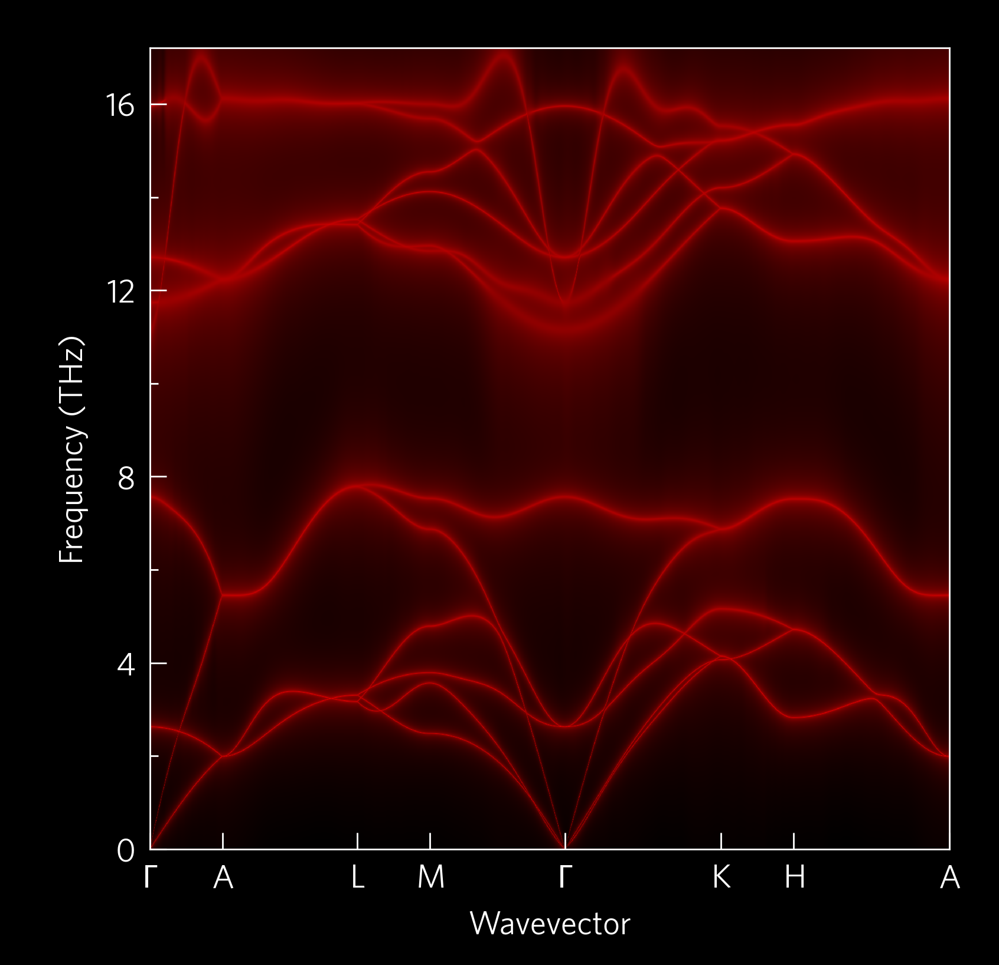

.. code-block::

     ________
    ///// \\\\
    \________/________________________________________________________________
    |_____                               : ___                                \
    | |   |                              :|   \                               /
    | |   |___   ___  |___  |_____   ___ :|___/  ___   |___   ___   ___  |___ \
    | |   |   | /   \ |   \ |  |  | /   \:|     /   |  |   \ /     /   \ |   \/
    | |   |   | |___/ |     |  |  | |   |:|     |   |  |     \___  |___/ |    \_____
    | |   |   | \___  |     |  |  | \___/:|     \___|_ |         \ \___  |    :3.1.2\
    |____________________________________:_______________________/____________:_____/

.. image:: https://travis-ci.com/smtg-bham/ThermoParser.svg?branch=master
    :alt: The travis-ci badge
    :target: https://travis-ci.com/smtg-bham/ThermoParser

ThermoParser is a toolkit used to simplify the analysis of data
produced by specialist materials science codes, centred around
thermoelectrics, but also useful for anything pertaining to electronic
and/ or phononic transport. ThermoParser is a Python library which
contains functions for data retrieval, manipulation and plotting, which
can be easily used with a little Python knowlege to generate a wide
array of high-quality plots in only a few lines of code. ThermoParser
also contains a suite of command-line tools which can retrieve specific
data, save derived properties and plot graphs in a single command.

Click on the image to go to the `gallery`_!

.. _gallery: https://smtg-bham.github.io/ThermoParser/gallery.html

Installation
------------

ThermoParser can easily be installed with git and pip:

.. code-block:: bash

    git clone https://github.com/smtg-bham/ThermoParser.git
    cd ThermoParser
    pip install .

After installing, you may want to copy ``ThermoParser/tprc.yaml`` to
``~/.config/tprc.yaml``, if you want to set your own default axis
labels, unit conversions, default style sheets (two are provided),
other aesthetic alterations and more!

Mac
^^^

If installing on an m1 mac, you can't currently pip install h5py, so a
longer process is required:

0. Install brew
1. Install hdf5 with brew
2. ``python3 -m pip install cython numpy``
3. ``brew info hdf5`` to retrieve the path to your hdf5 install
4. ``HDF5_DIR=YOUR_HDF5_PATH --no-build-isolation h5py``
5. ``git clone https://github.com/smtg-bham/ThermoParser.git``
6. ``cd ThermoParser``
7. ``pip install --user -e .``

Using conda may circumvent this process.

Command Line Interface (CLI)
----------------------------

ThermoParser uses `click`_, which has an easily navigable structure
from the command-line, detailed in the `tutorials`_.
The most frequently useful commands are included in the CLI for maximum
ease, including the ``tp get`` functions, which verbosely retrieve data
from files which are normally tiresome and error-prone to navigate; and
most of the simplest plot-types available through the Python interface.

Python Interface
----------------

ThermoParser is designed to have four main stages:

#. *Axes*:
     Pick an axis layout from ``tp.axes``.
#. *Load*:
     Use the functions is ``tp.data.load`` to load the relevant data.
#. *Add*:
     Use functions in ``tp.plot`` modules to add graphs to the axes.
#. *Save*:
     Use ``plt.savefig`` or equivalent to produce the figure.

As ThermoParser is dependent on matplotlib, each stage can be
substituted with bespoke code, e.g. using ``matplotlib.pyplot.subplots``
or ``matplotlib.axes.Axes.scatter``. These can still be supplemented
with ThermoParser helper functions, such as default labels which the
user can set in ``tp.settings``, colourmap generators in
``tp.plot.colour`` or legend helpers such as ``tp.axes.legend.alphabetise``.

The best way to get a feel for ThermoParser is to see it in action:
Take a look at our  `examples`_ and `tutorials`_. Currently supported
codes are:

.. _examples: https://github.com/smtg-bham/ThermoParser/tree/master/examples
.. _tutorials: https://smtg-bham.github.io/ThermoParser/tutorials.html

* Phononic properties:

  * `Phonopy <https://phonopy.github.io/phonopy/>`_
  * `Phono3py <http://phonopy.github.io/phono3py/>`_

* Electronic properties:

  * `AMSET <https://hackingmaterials.lbl.gov/amset/>`_
  * `BoltzTraP <https://www.imc.tuwien.ac.at/forschungsbereich_theoretische_chemie/forschungsgruppen/prof_dr_gkh_madsen_theoretical_materials_chemistry/boltztrap/>`_

Current plotting modes are split into four areas.

* ``tp.plot.phonons`` contains plots along a high-symmetry path,
  including phonon dispersions and plots which project other quantities
  onto these paths in various ways.
* ``tp.plot.frequency`` plots frequency on the x-axis, including density
  of states (DoS), cumulative kappa, "waterfall" and density plots.
  Each function has a ``main`` argument, which can be useful when
  plotting multiple quantities on the same set of axes; and an
  ``invert`` argument, which swaps the x and y axes to let you plot
  DoS-style next to a ``tp.plot.phonons`` plot.
* ``tp.plot.mfp`` contains a cumulative kappa against mean free path
  plot.
* ``tp.plot.heatmap`` contains a heatmap plotter, and wrappers which
  format appropriately for ZT against temperature and doping
  concentration; and one which plots the lattice thermal conductivity
  required to reach a target ZT, again against temperature and doping.

A set of example scripts is provided in the ``tp/examples`` folder and
in our online `examples`_, and there is `documentation`_.

Contributing
------------

We welcome any contributions, whether they be a feature request or a new
piece of code (or anything else). Adding options is inteded to be
straightforward; the modularity of the code means that each step is mostly
independent of the others.

Bugs and feature requests can be submitted to the `issue tracker`_,
while contributions can be made using the `fork and pull`_ approach.
Contributions should include comprehensive docstrings, and where
appropriate `examples`_, further `documentation`_ and `tests`_ are greatly
appreciated. Documentation uses the `sphinx`_ package, and can be built from
the ``docs`` directory with ``sphinx-build -b html src/ .``. In order to build
the docs, download the extra dependencies with, e.g., ``pip install .[docs]``
from the ThermoParser directory.

.. _issue tracker: https://github.com/smtg-bham/ThermoParser/issues
.. _fork and pull: https://guides.github.com/activities/forking
.. _documentation: https://smtg-bham.github.io/ThermoParser/
.. _tests: https://github.com/smtg-bham/ThermoParser/tree/master/tests

Testing
-------

Tests use the `unittest`_ package, and can be run from the test directory
with ``python3 -m unittest``. If you don't already have unittest installed, it
can be directly with ``pip install unittest`` or, e.g., ``pip install .[tests]``
from the ThermoParser directory.

.. _unittest: https://docs.python.org/3/library/unittest.html

Contributors
------------

Many thanks to all those who contributed code or ideas to ThermoParser!
Roughly chronologically, they are so far:

* Kieran B. Spooner
* Maud Einhorn
* David O. Scanlon
* Daniel W. Davies
* Bonan Zhu
* Sean R. Kavanagh
* Warda Rahim
* Katarina Brlec
* Joe Willis

License
-------

ThermoParser is licensed under the GNU Affero General Public License v3
(AGPLv3).

Requirements
------------

ThermoParser uses the following open-source packages:

* `click <https://click.palletsprojects.com/en/8.0.x/>`_
* `h5py <http://docs.h5py.org/>`_
* `json <https://docs.python.org/3/library/json.html>`_
* `matplotlib <https://matplotlib.org>`_
* `numpy <https://numpy.org>`_
* `pymatgen <https://pymatgen.org>`_
* `scipy <https://www.scipy.org>`_
* `sphinx <https://www.sphinx-doc.org>`_
* `yaml <https://pyyaml.org/>`_
