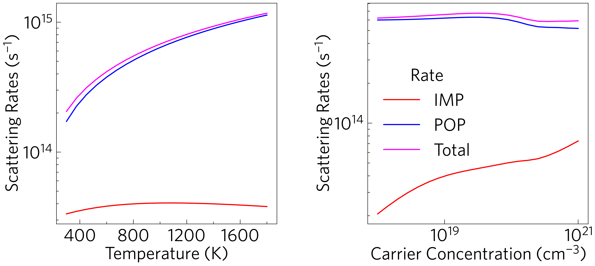

-------
Gallery
-------

.. toctree::
   :hidden:

   Heatmaps <heatmaps>
   Phonons <phonons>
   Density of States (DoS) <dos>
   Cumulative Kappa <cumkappa>
   Waterfalls <waterfalls>
   Projected Phonons <prophon>
   Average Scattering Rates <avg-rates>

This is a gallery of some things you can do in ThermoPlotter with brief
explanations. More details on each of the plots, including the scripts
and specific commands used are available by clicking on the figures, and we
also have `tutorials`_!

.. _tutorials: https://smtg-ucl.github.io/ThermoPlotter/tutorials.html

.. hint::
    Click on the images to see the script which generated them.

At its simplest, ``ThermoPlotter`` is a way to quickly plot useful data
from either a python script or the command line, such as the classic
``ztmap`` heatmap (the power factor ``pfmap`` is also available):

.. image:: figures/ztmap.png
   :alt: A heatmap of ZT against carrier concentration and temperature
   :target: https://smtg-ucl.github.io/ThermoPlotter/heatmaps.html

Click on the plot to see the script, or one could use

.. code-block:: bash

   tp plot ztmap boltztrap.hdf5 -k kappa-m<xxx>.hdf5 -c '#800080' -d x

A related plot we hope people find useful for screening materials to
run three+ phonon calculations on is the ``kappa-target`` plot, which
calculates the lattice thermal conductivity required to reach a given
ZT, in this case 2.

.. image:: figures/kappa-target.png
   :alt: A heatmap of target lattice thermal conductivity against carrier concentration and temperature
   :target: https://smtg-ucl.github.io/ThermoPlotter/heatmaps.html

.. code-block:: bash

   tp plot kappa-target boltztrap.hdf5 -c '#008080' -d x

Or on the analytical end of the process, ``zdiff`` and ``pfdiff`` allow
comparison among different datasets.

.. image:: figures/ztdiff.png
   :alt: A heatmap of differentce in ZT against carrier concentration and temperature
   :target: https://smtg-ucl.github.io/ThermoPlotter/heatmaps.html

.. code-block:: bash

   tp plot ztdiff <x>/boltztrap.hdf5 <y>/boltztrap.hdf5 -k <x>/kappa-m<xxx>.hdf5 <y>/kappa-m<yyy>.hdf5 -l <x> <y>

Slightly more complex plots also with command line scripts are the
phonon dispersions, which can be overlayed and plotted with DoSs.

.. image:: figures/multiphon.png
   :alt: A plot converging phonon dispersions against supercell size
   :target: https://smtg-ucl.github.io/ThermoPlotter/phonons.html

.. code-block:: bash

   tp plot phonons <list of band.yamls> -l <list of labels> -t 'Supercell\ Size'

.. image:: figures/phonons.png
   :alt: A phonon dispersion and DoS
   :target: https://smtg-ucl.github.io/ThermoPlotter/phonons.html

.. code-block:: bash

   tp plot phonons band.yaml -c '#ff8000' -d projected_dos.dat --doscolour '#ffff00' '#00ffff'

This is where some of the more useful functions of ``ThermoPlotter``
come in, e.g. the rescaling of the x axis in the former plot, and the
simplicity of compound axes in the latter. Another example is the ability to
add gaussian smearing to a DoS plot during plotting, removing the need to rerun
e.g. Phonopy or maintain multiple data files.

.. image:: figures/dos.png
   :alt: A DoS plot without and with gaussian smearing (sigma=0.2)
   :target: https://smtg-ucl.github.io/ThermoPlotter/dos.html

The right-hand plot can be plotted with:

.. code-block:: bash

   tp plot dos projected_dos.dat --atoms "Ba Sn O O_2 2" --sigma 0.2 --location 1 -c magenta -c cyan -c red -c orange

There are command-line scripts, but the main functionality is
intended as a python package, which enables much more customisable
plotting, to enable nicely formatted multi-axes plots...

.. image:: figures/cumkappa.png
   :alt: Cumulative kappa against frequency and mean free path, broken down by direction
   :target: https://smtg-ucl.github.io/ThermoPlotter/cumkappa.html

\...and multi-plot axes, to highlight particular interactions.

.. image:: figures/waterfall.png
   :alt: A plot of mean free path and lattice thermal conductivity against frequency overlaid on a DoS
   :target: https://smtg-ucl.github.io/ThermoPlotter/waterfall.html

As well as projecting third-order phonon properties onto each other as
above, so below we see there are also a number of functions for
projecting these properties onto phonon dispersions. The former is an
oft plotted widening of the bands due to scattering,\ :sup:`1` and the
latter shows the same data, but in a more quantitative way.

.. image:: figures/wideband.png
   :alt: A phonon dispersion where widened bands show phonon scattering
   :target: https://smtg-ucl.github.io/ThermoPlotter/prophon.html

.. code-block:: bash

   tp plot wideband band.yaml kappa-m<xxx>.hdf5 -c '#000000' '#ff0000' -s dark_background

.. image:: figures/prophon.png
   :alt: A phonon dispersion where dark colours show phonn scattering
   :target: https://smtg-ucl.github.io/ThermoPlotter/prophon.html

Besides plotting, ThermoPlotter offers a number of ways to streamline
transport property workflows, from generating more efficent input files
(``tp gen``), to data consolidation (``tp.utilities.merge``) and
retrieval (``tp.utilities.resolve`` and ``tp get``), to pre-typed axis labels,
because thats long... many of these outlined in the `tutorials`_, and some are
demonstrated in this line plot, which is not available as a python command,
but is easily scripted or plotted at the command line:

It shows the k-point and Fermi-Dirac weighted scattering rates against
temperature and carrier concentration, to give an accurate picture of their
effect on the electrical conductivity. This can also be done for the electron
mean free paths.

There are also a number of cosmetic options in
the python interface, which may be of interest outside the main scope of
ThermoPlotter, e.g. the custom colourmaps, legend formatting tools and axes
labels.

Reference
---------

.. code-block:: bibtex

    @article{Maradudin1962,
      title={Scattering of neutrons by an anharmonic crystal},
      author={Maradudin, AA and Fein, AE},
      journal={Physical Review},
      volume={128},
      number={6},
      pages={2589},
      year={1962},
      publisher={APS}
    }
