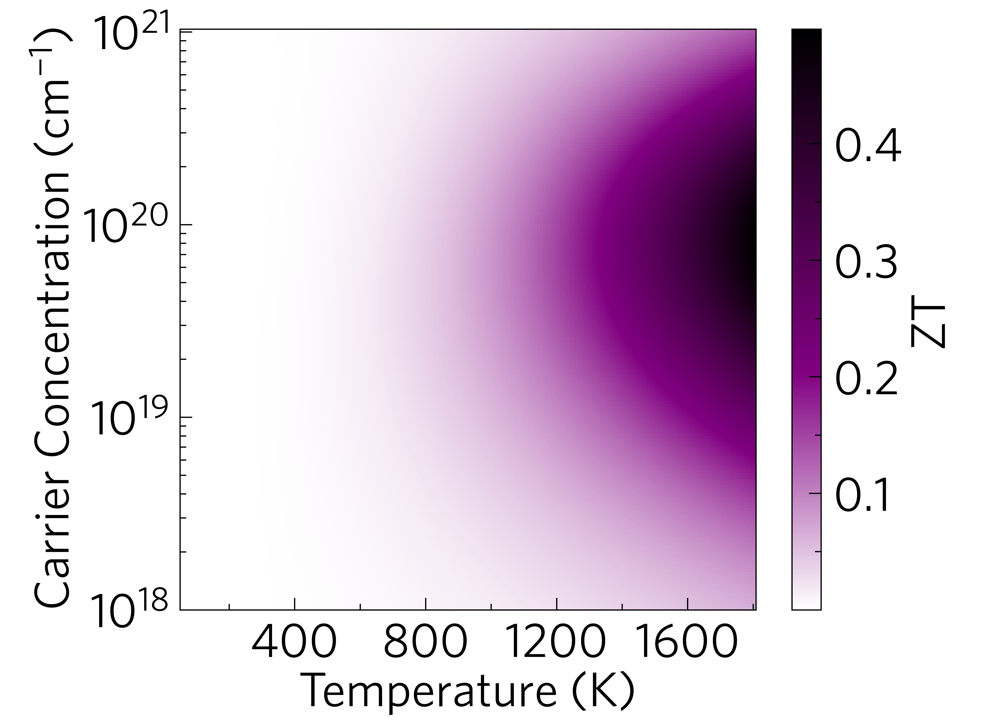
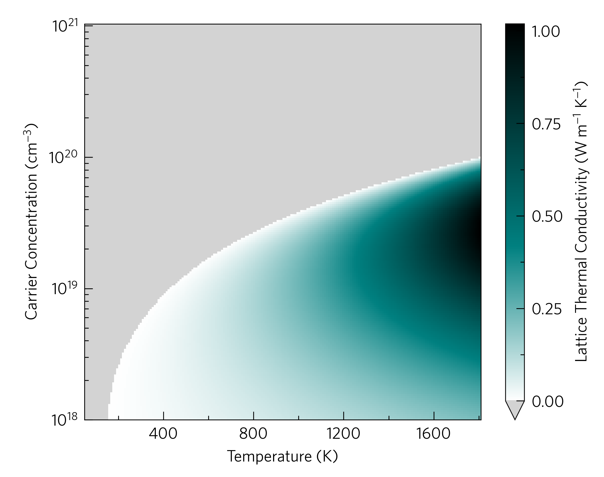
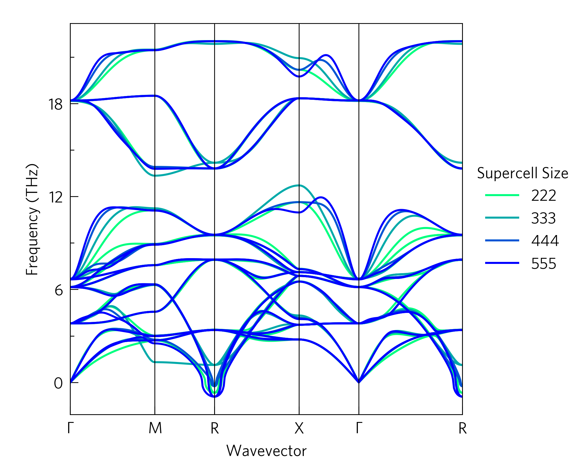
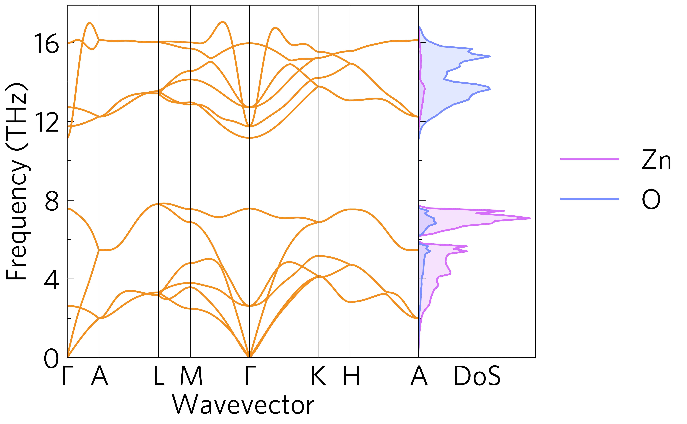
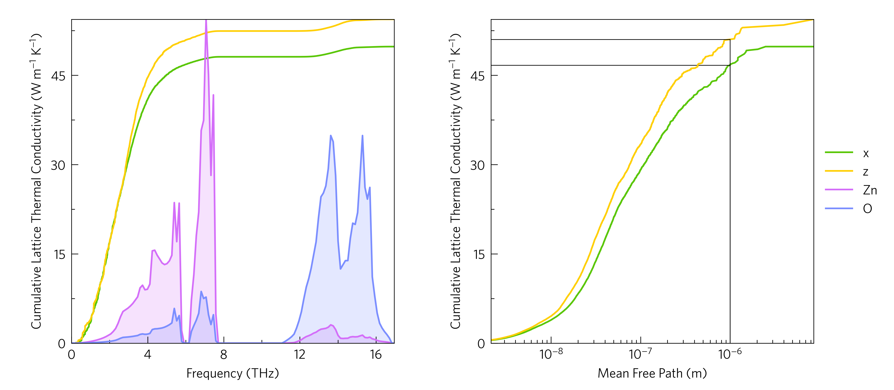
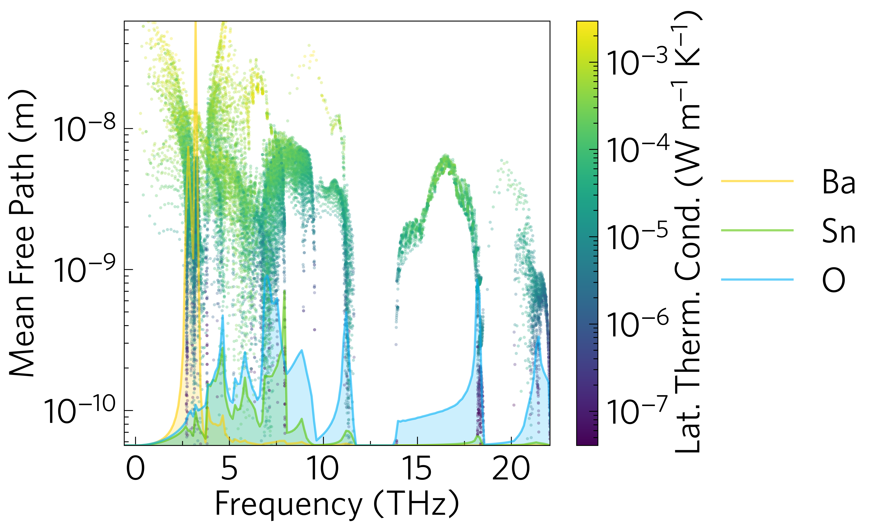
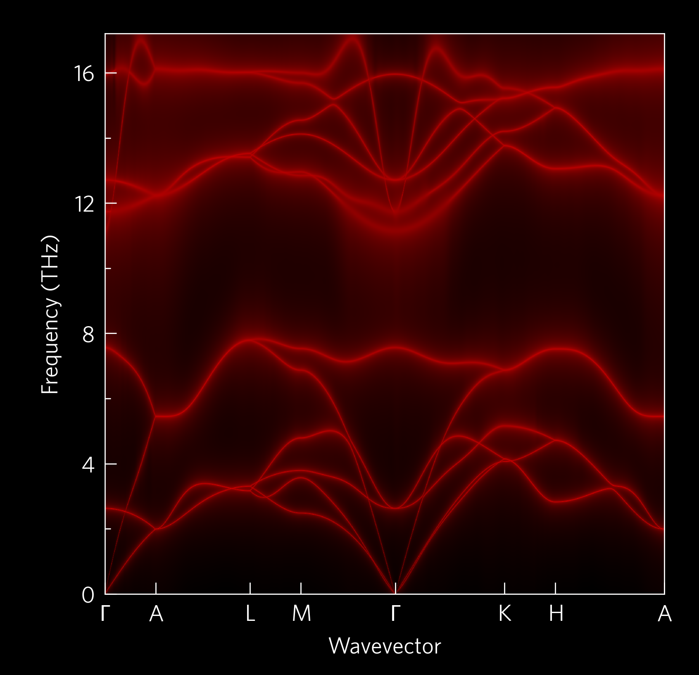
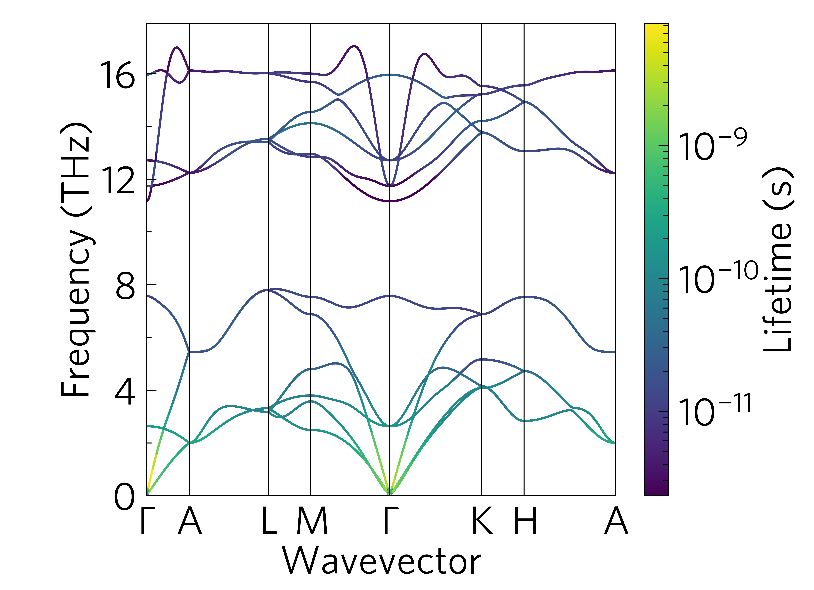
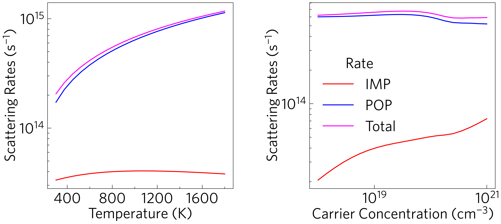

-------
Gallery
-------

.. toctree::
   :hidden:

   Heatmaps <heatmaps>
   Phonons <phonons>
   Density of States (DoS) <dos>
   Cumulative Kappa <cumkappa>
   Waterfalls <waterfalls>
   Projected Phonons <prophon>
   Average Scattering Rates <avg-rates>

This is a gallery of some things you can do in ThermoParser with brief
explanations. More details on each of the plots, including the scripts
and specific commands used are available by clicking on the figures, and we
also have `tutorials`_!

The data files provided are mostly from published work\ :sup:`1`, which
looks at the effectiveness of four transparent conducting oxides (TCOs)
as thermoelectrics. Using a pre-release version of this code, the main
problem was found to be their large lattice thermal conductivities,
contributed to most by their low-frequency modes which have large
mean free paths and group velocities. This is old work, and at the time
the constant relaxation time approximation (CRTA) via BoltzTraP was
used to calculate the electronic transport properties. Since then, we
have recalculated the properties with the momentum relaxation time
approximation (MRTA) via AMSET, and found using explicit electronic
relaxation times via MRTA significantly alters the results. This is both
due to the inclusion of more realistic scattering trends with
temperature and carrier concentration (`average-rates`_), and the ability
to alter the electronic scattering rates rather than just the phononic
ones when simulating nanostructuring. This leads to a much reduced
electrical conductivity in BaSnO\ :sub:`3`, and therefore a much lower
ZT (`ztdiff`_), although these trends will vary significantly by
material.

Note:
^^^^^

Some examples require large data files to run, which haven't been
included in the data folder, but can be downloaded using the
``get-data.sh`` script provided in the examples directory. If ``wget`` doesn't
work for you, navigate to the URL (``repo`` in ``get-data.sh``) in your
browser to download the required file and add it to the ``../data``
directory (``f`` in ``get-data.sh``).

.. _tutorials: https://smtg-bham.github.io/ThermoParser/tutorials.html
.. _average-rates: https://github.com/smtg-bham/ThermoParser/tree/master/examples/avg-rates
.. _ztdiff: https://github.com/smtg-bham/ThermoParser/tree/master/examples/heatmaps

.. hint::
    Click on the images to see the script which generated them.

At its simplest, ``ThermoParser`` is a way to quickly plot useful data
from either a python script or the command line, such as the classic
``ztmap`` heatmap (the power factor ``pfmap`` is also available):

Click on the plot to see the script, or one could use

.. literalinclude:: ../../examples/heatmaps/plot-zt.sh
   :language: bash

A related plot we hope people find useful for screening materials to
run three+ phonon calculations on is the ``kappa-target`` plot, which
calculates the lattice thermal conductivity required to reach a given
ZT, in this case 2.

.. literalinclude:: ../../examples/heatmaps/plot-kappa-target.sh
   :language: bash

Or on the analytical end of the process, ``zdiff`` and ``pfdiff`` allow
comparison among different datasets.

.. image:: figures/ztdiff.png
   :alt: A heatmap of differentce in ZT against carrier concentration and temperature
   :target: https://smtg-bham.github.io/ThermoParser/heatmaps.html

.. literalinclude:: ../../examples/heatmaps/plot-ztdiff.sh
   :language: bash

Slightly more complex plots also with command line scripts are the
phonon dispersions, which can be overlayed and plotted with DoSs.

.. literalinclude:: ../../examples/phonons/plot-multiphon.sh
   :language: bash

.. literalinclude:: ../../examples/phonons/plot-phonons.sh
   :language: bash

This is where some of the more useful functions of ``ThermoParser``
come in, e.g. the rescaling of the x axis in the former plot, and the
simplicity of compound axes in the latter. Another example is the ability to
add gaussian smearing to a DoS plot during plotting, removing the need to rerun
e.g. Phonopy or maintain multiple data files.

.. image:: figures/dos.png
   :alt: A DoS plot without and with gaussian smearing (sigma=0.2)
   :target: https://smtg-bham.github.io/ThermoParser/dos.html

The left-hand plot can be plotted with:

.. literalinclude:: ../../examples/dos/plot-dos-total.sh
   :language: bash

And the right-hand plot can be plotted with:

.. literalinclude:: ../../examples/dos/plot-dos-smeared.sh
   :language: bash

There are command-line scripts, but the main functionality is
intended as a python package, which enables much more customisable
plotting, to enable nicely formatted multi-axes plots...

\...and multi-plot axes, to highlight particular interactions.

As well as projecting third-order phonon properties onto each other as
above, so below we see there are also a number of functions for
projecting these properties onto phonon dispersions. The former is an
oft plotted widening of the bands due to scattering,\ :sup:`2` and the
latter shows the same data, but in a more quantitative way.

.. literalinclude:: ../../examples/projected-phonons/plot-wideband.sh
   :language: bash

Besides plotting, ThermoParser offers a number of ways to streamline
transport property workflows, from generating more efficent input files
(``tp gen``), to data consolidation (``tp.utilities.merge``) and
retrieval (``tp.utilities.resolve`` and ``tp get``), to pre-typed axis labels,
because thats long... many of these outlined in the `tutorials`_, and some are
demonstrated in this line plot, which is not available as a python command,
but is easily scripted or plotted at the command line:

.. literalinclude:: ../../examples/avg-rates/plot-avg-rates.sh
   :language: bash

It shows the k-point and Fermi-Dirac weighted scattering rates against
temperature and carrier concentration, to give an accurate picture of their
effect on the electrical conductivity. This can also be done for the electron
mean free paths.

There are also a number of cosmetic options in
the python interface, which may be of interest outside the main scope of
ThermoParser, e.g. the custom colourmaps, legend formatting tools and axes
labels.

Reference
---------

[1] K. B. Spooner, A. M. Ganose and D. O. Scanlon, *J. Mater. Chem. A*, **2020**, 8, 11948.
[2] A. A. Maradudin and A. E. Fein, *Phys. Rev.*, **1962**, 128, 2589.