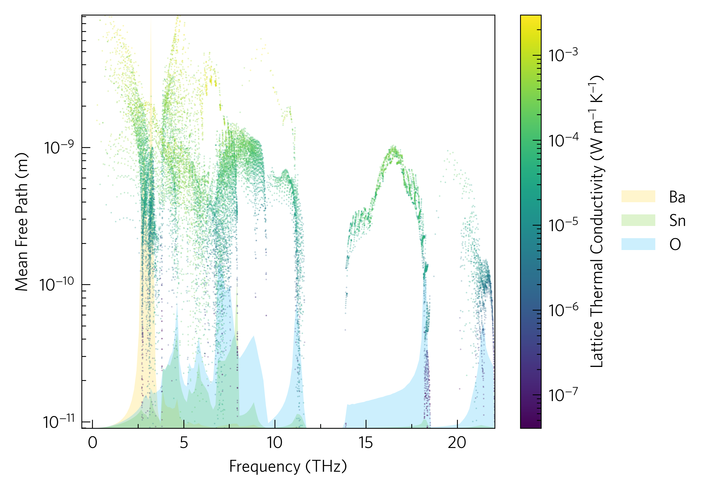
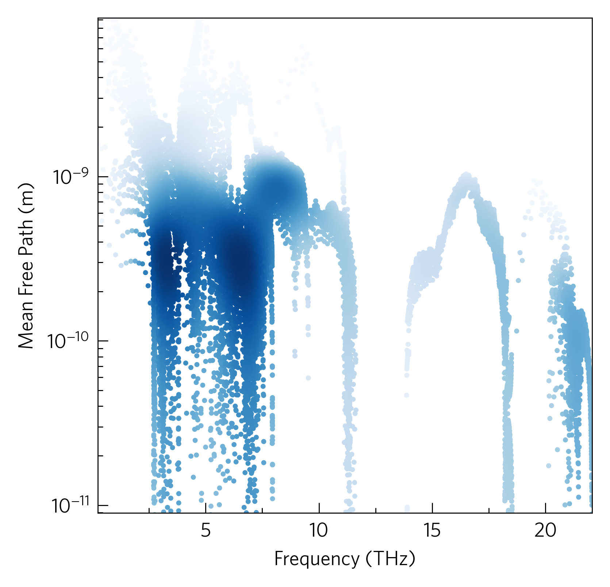

---------
Waterfall
---------

This shows a plot of mean free path against frequency with lattice
thermal conductivity projected on the colour axis, as well as a density
of states (DoS). It shows the connections between phonon scattering and
the constituent elements, for example there seems to be a big drop in
phonon mean free path in the frequencies with high amounts of Ba
character.

While plots cannot be layered at the command line like this, the
waterfall section can be plotted with:

.. codeblock::
   tp plot waterfall ../data/basno3/kappa-m363636.hdf5 -y mfp --projected kappa

And in python:

.. literalinclude:: plot-waterfall.py
   :language: python
   :linenos:
   :emphasize-lines: 36,37

This example highlights a complication: in order for the
waterfall to be on top of the DoS, so as not to obscure the projected
colour, an additional command, ``format_waterfall``, must be used so
the DoS can be scaled correctly but plotted first (line 36-37).

Replacing ``add_projected_waterfall`` with simply ``add_waterfall``
removes the projection, and colours it with a single colour or by band
index as you prefer. This is achieved by removing the ``--projected``
tag at the command line.

This is an alternative of the waterfall plot, where the colour darkness
shows the density of the points, which is often clearer than just
adjusting the alpha parameter on the regular waterfall plot.

It can be plotted at the command line with:

.. codeblock::
   tp plot waterfall ../data/basno3/kappa-m363636.hdf5 -y mfp --projected density -c Blues

Or in python with:

.. literalinclude:: plot-density.py
   :language: python
   :linenos:
