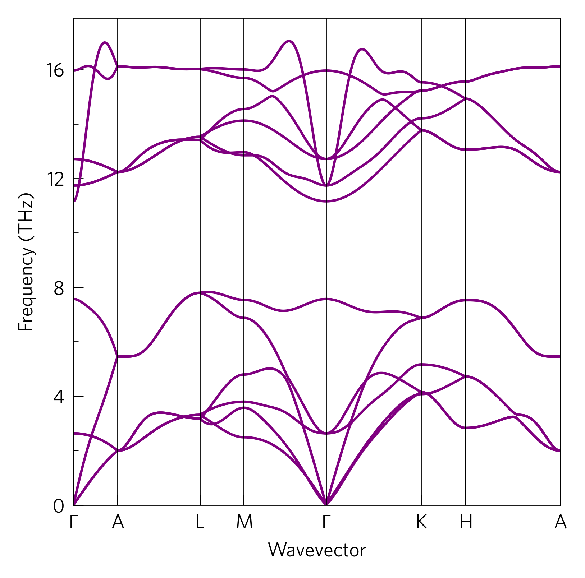

The most basic plots in ThermoPlotter consist of four commands:

 1. axes
 2. load
 3. plot
 4. save

ThermoPlotter offers ways to do the first three (the last is trivial),
but each part can be replaced by your own code if you prefer.

The CLI version of this code is:

.. code-block:: bash

   tp plot phonons ../data/zno/band.yaml

----
Axes
----

ThermoPlotter offers a number of pre-sized axes in the ``axes`` module.
Within, there is a ``large`` module, which provides presentation-
oriented figures, but these take relatively long to load so here we use
``small``, which is better for papers. The functions consist of the
number of primary axes, and a description where necessary. In this
case, we use the most basic ``one``.

Every function returns three things:

 1. figure: The whole plot area, used in step 4.
 2. axes: Where the data goes, used in step 3.
 3. add_legend: Adds a legend. We don't use it here, so we've thrown it
    away by assigning it to ``_``. Giving it any name and not using it
    has the same effect. Legends will be discussed in ``03-compound-axes``.

This command can easily be replaced with ``matplotlib.pyplot`` commands
such as ``figure`` and ``subfigs``.

----
Load
----

ThermoPlotter contains several data loading functions for different
inputs in the ``data.load`` module. At their most basic, these take a
file to read from, and return a dictionary of the data.

While you can load your own data, ThermoPlotter takes several steps to
ensure consistent format and units between codes and also with some
old versions of these codes; and with the plotting functions. It also
consistently applies custom unit conversions and provides metadata
including array shapes, units and data sources, so care should be
taken if this step is done manually.

----
Plot
----

ThermoPlotter contains a number of plotting functions in the ``plot``
module. At their most basic, they take a set of axes to plot on, and a
data dictionary to read from. All plot functions also take a number of
customisation option, including all the ``kwargs`` from the underlying
``matplotlib`` function.

This stage can be replaced with ordinary ``matplotlib`` functions such
as ``ax.plot``, which can be assisted by a number of ancillary
ThermoPlotter functions discussed in ``05-helper-functions``.

----
Save
----

Simply ``figure.savefig(name.extension)``.
