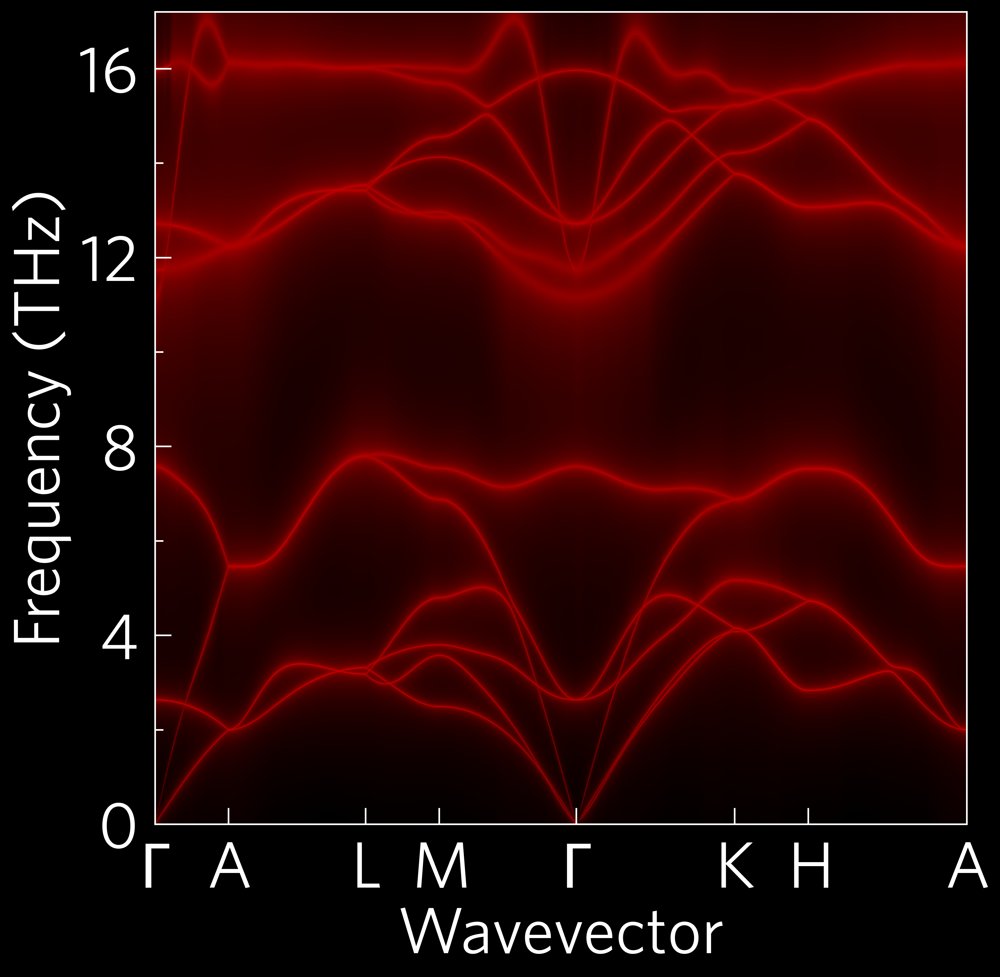

In most cases, plotting scripts will be more complex than ``01-python-foundations``.
Many functions require more inputs, and most users will want to
customise plots with colours and stuff.

The CLI version of this code is:

.. code-block:: bash

   tp plot wideband ../data/zno/band.yaml ../data/zno/kappa-m404021.hdf5 --large -s dark_background -c '#000000' -c '#ff0000' --poscar ../data/zno/POSCAR

---------
Variables
---------

It's handy to put variables you might want to edit at the top of the
script, and also tidy in the case of long paths like here, so all
future examples will be written this way.

----
Axes
----

All axes can take a style sheet or list of style sheets as arguments.
``matplotlib`` comes with many preinstalled, and you can also make your
own and put them in ``~/.config/matplotlib/stylelib/``. I've installed
a couple for you already :wink:. You can list them by importing pyplot
and typing ``print(plt.style.available)`` in Python.

----
Load
----

Several plot functions, including all of the projected phonon
dispersions such as this, require multiple data inputs, so multiple
load steps are required. Most load functions also take a ``quantities``
argument, which tells them exactly what to load, and can be a list or a
space-delimited string. In this case, there is a shorthand,
``wideband``, which stands in for ``'frequency gamma'``.

----
Plot
----

Plot commands take a wide range of arguments, from the standard
matplotlib kwargs such as ``alpha`` (transparency) and calculation
conditions, such as ``temperature``, to custom ThermoPlotter inputs,
like here where we've provided two colours (black and red respectively)
which ThermoPlotter can use to generate a custom colourmap. DoS plots
and all projected phonon plots also require a POSCAR file.
