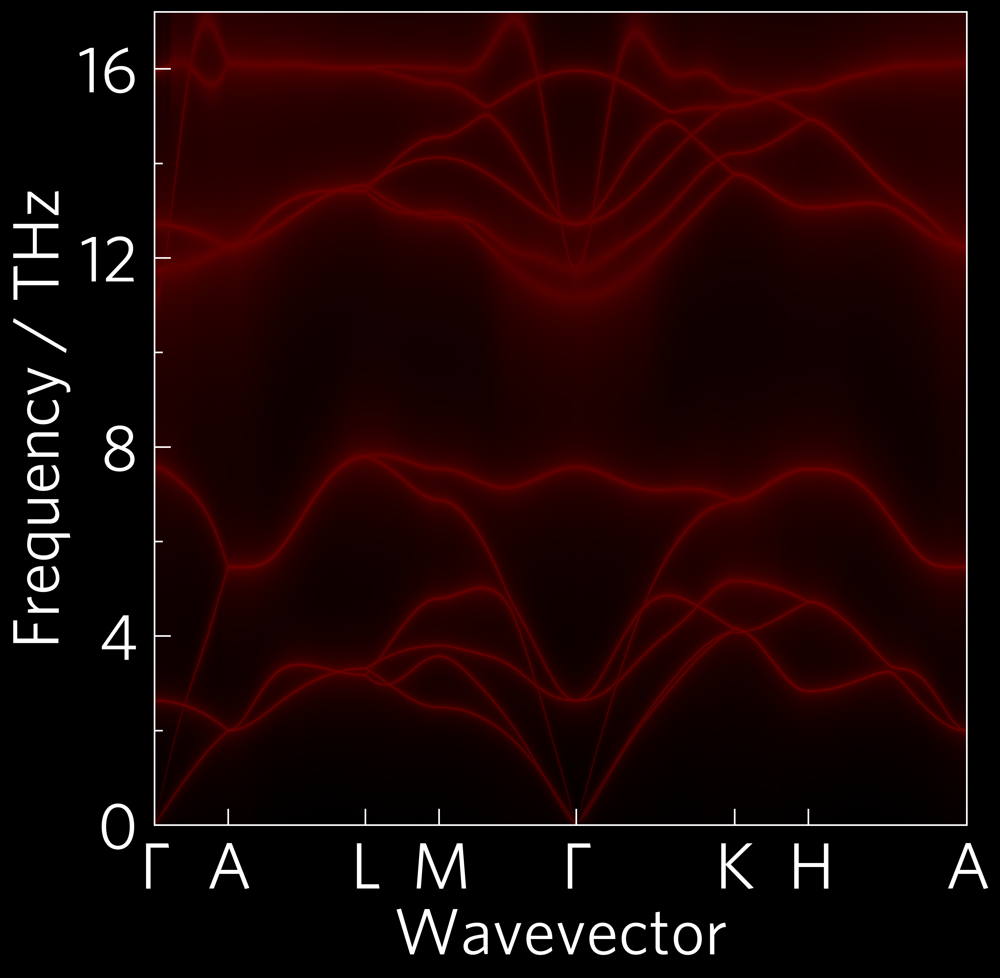

-------------------------------------
Tutorial-02: Individual Customisation
-------------------------------------

Like tutorial-01, this is a phonon dispersion, but this time the modes
have been broadened in relation to the imaginary component of their
self-energy. This represents the degree to which they scatter (broader
modes indicates more scattering). More scattering causes a decrease in
lattice thermal conductivity. The data for the scattering comes from
Phono3py, which also uses the supercell approach.

In most cases, plotting scripts will be more complex than `Tutorial-01`_.
Many functions require more inputs, and most users will want to
customise plots with colours and stuff.

The CLI version of this code is:

.. code-block:: bash

   tp plot wideband ../data/zno/band.yaml ../data/zno/kappa-m404021.hdf5 --large -s dark_background -c '#000000' -c '#ff0000' --poscar ../data/zno/POSCAR

And the python version is:

.. literalinclude:: ../../examples/02-individual-customisation/tutorial-02.py
   :language: python
   :linenos:
   :emphasize-lines: 6-9,24,27,28,31,32

Variables (lines 6-9)
---------------------

It's handy to put variables you might want to edit at the top of the
script, and also tidy in the case of long paths like here, so all
future examples will be written this way.

Axes (line 24)
--------------

All axes can take a style sheet or list of style sheets as arguments.
``matplotlib`` comes with many preinstalled, and you can also make your
own and put them in ``~/.config/matplotlib/stylelib/``. I've installed
a couple for you already. You can list them by importing pyplot
and typing ``print(plt.style.available)`` in Python.

Load (lines 27-28)
------------------

Several plot functions, including all of the projected phonon
dispersions such as this, require multiple data inputs, so multiple
load steps are required. Most load functions also take a ``quantities``
argument, which tells them exactly what to load, and can be a list or a
space-delimited string. In this case, there is a shorthand,
``wideband``, which stands in for ``'frequency gamma'``.

Plot (lines 31-32)
------------------

Plot commands take a wide range of arguments, from the standard
matplotlib kwargs such as ``alpha`` (transparency) and calculation
conditions, such as ``temperature``, to custom ThermoParser inputs,
like here where we've provided two colours (black and red respectively)
which ThermoParser can use to generate a custom colourmap. DoS plots
and all projected phonon plots also require a POSCAR file.

Colourmaps
----------

Some functions, including heatmaps and projected dispersions such as
the wideband plot above, accept single colours which are passed to
ThermoParser's `colourmap generators`_. These can also be accessed
directly, allowing greater control of the output or use on non-tp
applications. The colourmap used here could be generated with:

.. code-block:: python

   tp.plot.colour.linear(cmin='black', cmax='red')

``linear`` interpolates linearly between the colours, and is used for
projected dispersions. ``elbow`` provides two linear sections with a
midpoint you specify, and ``uniform`` calculates the midpoint position
based on the relative compositions of the colours, which is used for
heatmaps.

.. _Tutorial-01: https://smtg-bham.github.io/ThermoParser/tutorial-01.html
.. _colourmap generators: https://smtg-bham.github.io/ThermoParser/tp.plot.html#module-tp.plot.colour