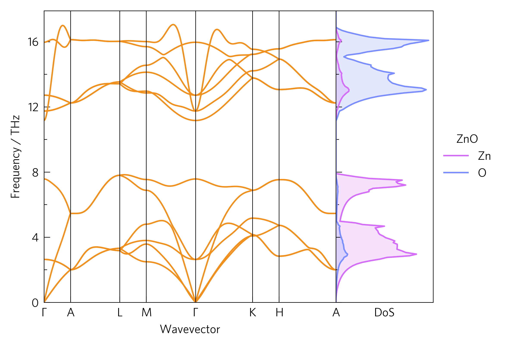

--------------------------
Tutorial-03: Compound Axes
--------------------------

Often, a good way to draw links between data is to position them
together. Here, the DoS shows which atoms affect which parts of the
phonon dispersion. ThermoPlotter offers a number of ways to streamline
comparing graphs, including compound axes and enhanced legend handling.

The CLI version of this code is:

.. code-block:: bash
   
   tp plot phonons ../data/zno/band.yaml -c '#f0901f' --dos ../data/zno/projected_dos.dat --doscolour '#d46ef9' --doscolour '#7b8eff' --legend_title ZnO --location 2

And the python version is:

.. literalinclude:: tutorial-03.py
   :language: python
   :linenos:
   :emphasize-lines: 15,22,23,27

Axes (line 15)
--------------

Rather than discard the ``add_legend`` function, we now need to keep
it. We also a different axes function, ``one_dos``, which contains a
standard set of axes and a small ancillary one for the DoS. As there
are multiple axes, ``ax`` is now a list of axes.

Plot (lines 22-23)
------------------

As ``ax`` is a list, we need to index it with ``[]`` to select which
one we want to plot on. The order is always the same as they appear on
the plot. As we want the DoS plot to share the frequency axes with the
dispersion, the ``invert`` argument is used. All plotting functions in
the ``frequency`` module have this argument. We also need to match the
axes together, which is done on line 26.

As an aside, in this case we have used a POSCAR to specify which atoms
are shown in the DoS, but this can also be specified manually with the
``atoms`` argument. This takes a string of space-delimited items, which
are either atom names (e.g. Zn) or numbers corresponding to the
previous atom name. In this way, atoms in different environments can be
separated, or multiple unalike atoms can be plotted as one.

Legend (line 27)
----------------

``add_legend`` places a legend at one of several pre-designed places,
depending on the axes function. The default is usually to the right of,
or above the axes, which could be specified by ``right`` or ``above``
respectively, but it can also be placed inside a set of axes using
numbers, from left to right then top to bottom. Here, there is space in
the second (DoS) axes, so we have specified place ``2``. It also takes
most normal ``matplotlib`` legend arguments, such as ``title`` here.
For figures with more than one set of axes, the labels are consolidated
into one legend, with duplicates removed, which uses up the ``handles``
and ``labels`` arguments, so in order to specify your own, you must set
``custom=True`` (not necessary for single-axes figures).
``tp.axes.legend.consolidate`` may also be useful for non-ThermoPlotter
endaevors, as will be discussed in `Tutorial-05`_.

.. _Tutorial-05: https://smtg-ucl.github.io/ThermoPlotter/tutorial-05.html