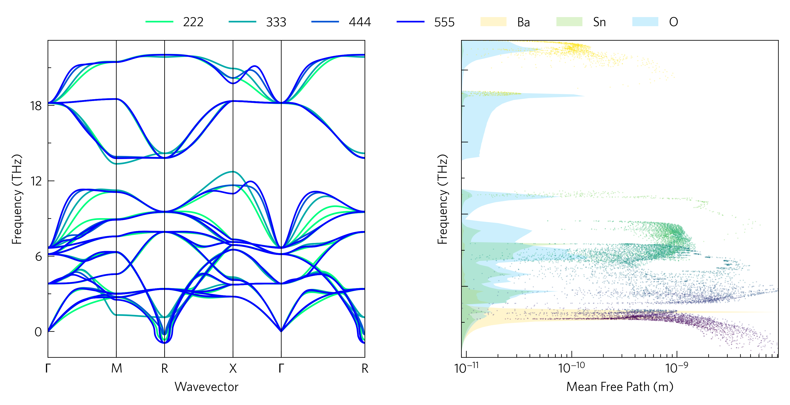

As well as plotting graphs on neighbouring axes, it can be informative
to plot them on the same axes to highlight links, for example how the
mean free paths of phonons in BaSnO3 dip where Ba has a
strong contribution to the DoS, or how a phonon dispersion converges
with supercell size. Although this can start to make scripts more
complicated, and is not yet supported by the CLI, it is often worth the
effort.

----
Axes
----

Here we use ``two_h``. h stands for horizontal, and there is a
corresponding vertical set of axes, ``two_v``. They also come with
space for colourbars, by adding ``_colourbars`` to their names.

----
Load
----

We need lists of files here, we've used list comprehensions to generate
the file names and load them, but you could also use something like:

.. code-block:: python

    from glob import glob
    pfiles = glob('band-*.yaml')

Although in that case, you would also need to define the labels.

----
Plot
----

``add_dos`` and ``add_cumkappa`` have the arguments ``main`` and
``scale``, which enable them to be used on the same axes as plots with
other axis scales. ``main``causes the axes ticks, labels and limits to
be set for the plot, so turning it off doesn't interfere with the
current configuration. ``scale`` scales the data to the axes, rather
than the axes to the data, so everything is visible. If both ``main``
and ``scale`` are set, the y-axis (or x, if ``invert``) is scaled to
percent.

It can look better to have the waterfall plot above the DoS, but the
DoS should be scaled to the waterfall axes. Therefore, there is a
function, ``format_waterfall``, which sets the scale without plotting
the waterfall plot. Running ``format_waterfall``, then ``add_dos``,
then ``add_waterfall`` solves this, however it doesn't work properly if
``line=True``.

----------
Formatting
----------

Setting ``invert`` removes the y-axis labels and shortens the x-axis
one in anticipation of being a DoS-style set of axes, but this can be
reversed with some helper functions: ``set_locators`` sets the axis
scales and tick locators for each axis, and also has a DoS argument,
which removes the ticks and tick labels and the y axis label, while all
the default labels can be accessed with ``settings.labels``. These will
be covered more in ``05-helper-functions``.
