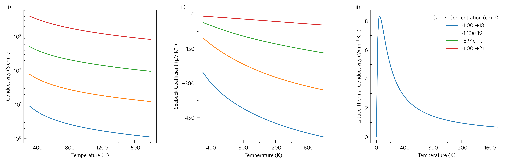

-----------------------------
Tutorial-05: Helper Functions
-----------------------------

This shows simple line plots of electrical conductivity, Seebeck
coefficient and lattice thermal conductivity. Thermoelectrics require a
balance of high electrical conductivity and Seebeck coefficient, but
low thermal conductivity to be efficient.

ThermoParser contains a number of helper functions that may be useful
even when not using the core functionality. We will cover several of
these here, however this particular example is also plottable via the
CLI:

.. code-block::

    tp plot transport ../data/basno3/transport_75x75x75.json -k ../data/basno3/kappa-m363636.hdf5 -q conductivity -q seebeck -q lattice_thermal_conductivity -n 1e18 -n 1e19 -n 1e20 -n 1e21 --tmin 0 --location 3

In Python, it is:

.. literalinclude:: ../../examples/05-helper-functions/tutorial-05.py
   :language: python
   :linenos:
   :emphasize-lines: 20,36,38,41,45-49,51-54

Axes (line 20)
--------------

ThermoParser comes with two ``matplotlib`` styles, ``tp`` and
``tp-large``, for small and large axes respectively, which are
accessible any time using ``plt.style.use``.

Resolve (lines 36 and 41)
-------------------------

``tp.data.utilities.resolve`` resolves a data array by dependent
properties. As arguments, it takes a data dictionary, an array of the
names of the quantities to be resolved, and the dependent variable
values. This can be used easily with data loaded through ThermoParser,
but with some minor alterations, almost any data can be resolved.

Most ThermoParser data dictionaries come with a ``meta``
subdictionary, which contains metadata including units, array shapes
and data source. For ``resolve`` to work, it needs a ``dimensions``
subdictionary in ``meta``, which should contain an array with the same
name as the variable to be resolved. This should contain the names of
the dependent variables in the order of the data dimensions, except
directions, which can be either 3 or 6. For example,
``adata['meta']['dimensions']['seebeck'] == ['temperature', 'doping', 3, 3]``.
The direction is represented by a 3x3 array. The other thing that is
needed is for the dependent variables to also be in the dictionary.
ThermoParser automatically loads dependent variables.

``resolve`` does not interpolate, but rather rounds to the nearest data
point, which it saves to ``['meta']['variable_name']``, so you can be
sure what the data is. This is also useful in setting legend labels, as
on line 38.

Locators, Ticks and Labels (lines 45-49)
----------------------------------------

There are several functions to aid in formatting axes.
``tp.settings.labels``, and its variations ``large_``, ``long_``,
``medium_`` and ``short_labels`` return a dictionary of axes labels
(more on these in ``06-package-customisation``).
``tp.plot.utilities.set_locators`` sets the locators, if you provide a
set of axes and set ``x`` and ``y`` to either ``'linear'`` or ``'log'``
as appropriate.

Legends (lines 51-54)
---------------------

``tp.axes.legend.consolidate`` consolidates the legends of a list of
axes into one, ensuring no duplicates, and returns the handles and
labels, which can then be passed to ``ax.legend``.

Not exactly a legend, but ``tp.axes.legend.alphabetise`` adds labels
to the axes. ``preset``s are available for ``latin`` and ``greek``
alphabetisation, and ``arabic`` and ``roman`` enumeration.
Capitalising the first letter (e.g. ``Greek``) will capitalise the
labels where applicable. Fully custom labels can also be specified
using the ``labels`` argument, along with ``prefix``\ es and
``suffix``\ es, and the position can be modified with ``x`` and ``y``.
