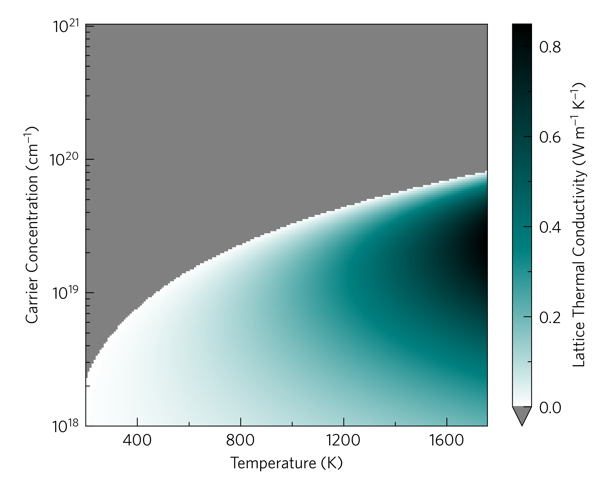
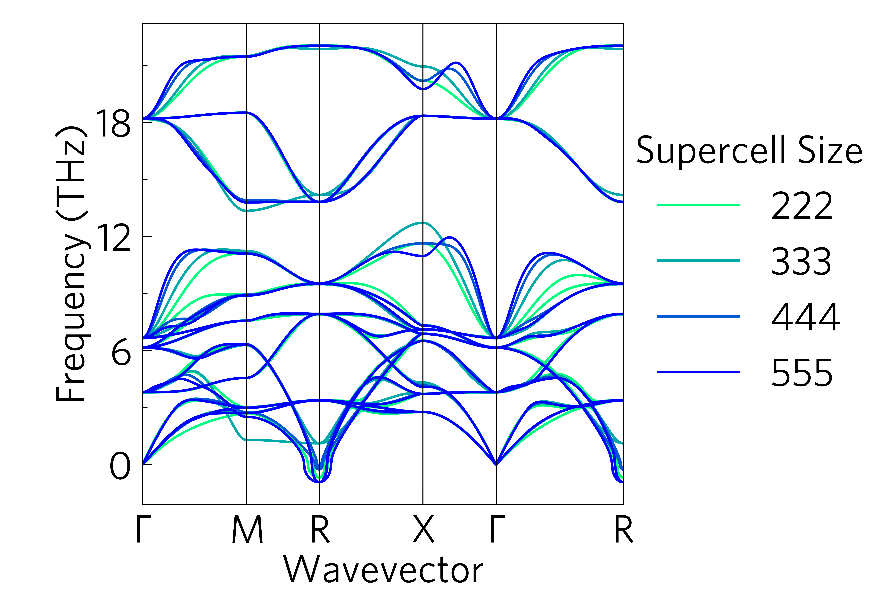
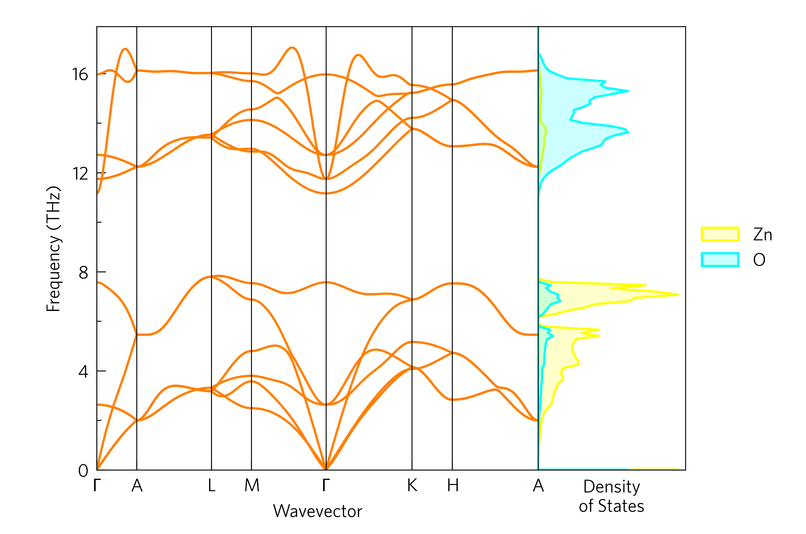
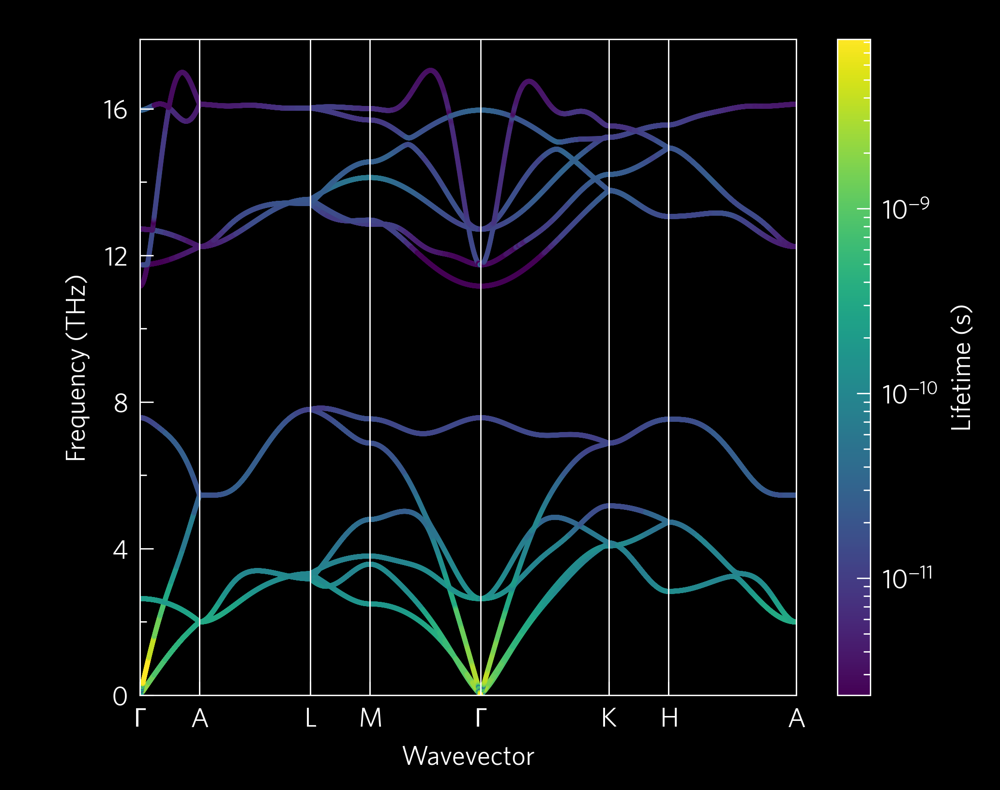
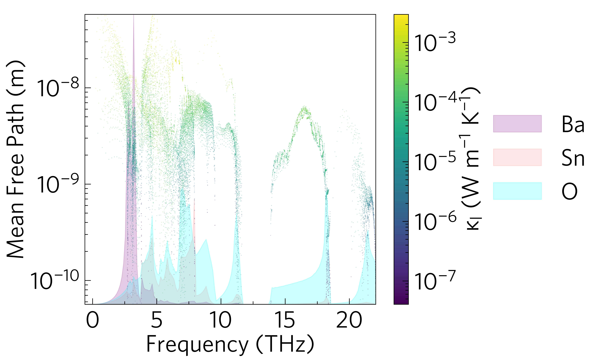
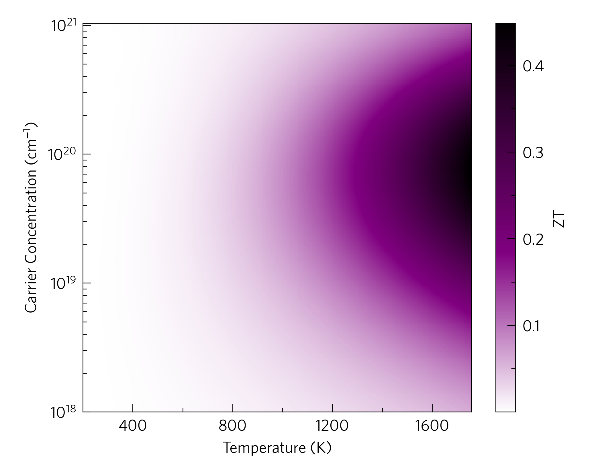

Here are some examples to give an idea of what ThermoPlotter can do.
Some require large data files to run, which haven't been included in the
data folder, but can be downloaded using the ``get-data.sh`` script
provided in the relevant directories.

cumkappa
--------

.. image:: cumkappa/cumkappa.png
   :alt: Cumulative lattice thermal conductivity against frequency and mean free path.
   :target: https://github.com/SMTG-UCL/ThermoPlotter/tree/master/examples/cumkappa

kappa-target
------------

multiphon
---------

phonons
-------

projected-phonons
-----------------

waterfall
---------

wideband
--------

.. image:: wideband.png
   :alt: Phonon dispersion with broadened bands.
   :target: https://github.com/SMTG-UCL/ThermoPlotter/tree/master/examples/wideband

ztmap
-----

