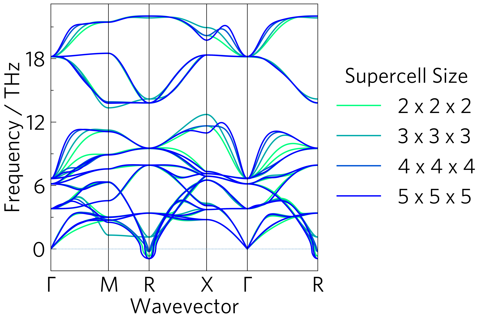

Here are some examples to help you get started with ThermoParser. The
numbered examples aim to provide a tutorial of how the package in
general works, while the rest show some more concrete examples you
might find in published work.

The data files provided are mostly from published work\ :sup`1`, which
looks at the effectiveness of four transparent conducting oxides (TCOs)
as thermoelectrics. Using a pre-release version of this code, the main
problem was found to be their large lattice thermal conductivities,
contributed to most by their low-frequency modes which have large
mean free paths and group velocities. This is old work, and at the time
the constant relaxation time approximation (CRTA) via BoltzTraP was
used to calculate the electronic transport properties. Since then, we
have recalculated the properties with the momentum relaxation time
approximation (MRTA) via AMSET, and found using explicit electronic
relaxation times via MRTA significantly alters the results. This is both
due to the inclusion of more realistic scattering trends with
temperature and carrier concentration (`avg-rates`_), and the ability
to alter the electronic scattering rates rather than just the phononic
ones when simulating nanostructuring. This leads to a much reduced
electrical conductivity in BaSnO\ :sub:`3`, and therefore a much lower
ZT (`ztdiff`_), although these trends will vary significantly by
material.

.. _avg_rates: https://github.com/smtg-bham/ThermoParser/tree/master/examples/avg-rates
.. _ztdiff: https://github.com/smtg-bham/ThermoParser/tree/master/examples/heatmaps

Some examples require large data files to run, which haven't been
included in the data folder, but can be downloaded using the
``get-data.sh`` script provided in this directory. If ``wget`` doesn't
work for you, navigate to the URL (``repo`` in ``get-data.sh``) in your
browser to download the required file and add it to the ``../data``
directory (``f`` in ``get-data.sh``).

avg-rates
---------

.. image:: avg-rates/avg-rates.png
   :alt: Electronic scattering rates averaged over band and k-point and weighted according to the derivative of the Fermi-Dirac distribution with respect to energy, against temperature and carrier concentration respectively.
   :target: https://github.com/smtg-bham/ThermoParser/tree/master/examples/avg-rates

cumkappa
--------

.. image:: cumkappa/cumkappa.png
   :alt: Cumulative lattice thermal conductivity against frequency and mean free path.
   :target: https://github.com/smtg-bham/ThermoParser/tree/master/examples/cumkappa

kappa-target
------------

.. image:: kappa-target/kappa-target.png
   :alt: Lattice thermal conductivity required to reach a given ZT against carrier concentration and temperature.
   :target: https://github.com/smtg-bham/ThermoParser/tree/master/examples/kappa-target

phonons
-------

.. image:: phonons/phonons.png
   :alt: Phonon dispersion and density of states.
   :target: https://github.com/smtg-bham/ThermoParser/tree/master/examples/phonons

multiphon
---------

wideband
--------

.. image:: projected-phonons/wideband.png
   :alt: Phonon dispersion with broadened bands.
   :target: https://github.com/smtg-bham/ThermoParser/tree/master/examples/projected-phonons

projected-phonons
-----------------

.. image:: projected-phonons/prophon.png
   :alt: Phonon dispersion with phonon lifetime projected.
   :target: https://github.com/smtg-bham/ThermoParser/tree/master/examples/projected-phonons

waterfall
---------

.. image:: waterfall/waterfall.png
   :alt: Waterfall plot of mean free path against frequency with lattice thermal conductivity projected.
   :target: https://github.com/smtg-bham/ThermoParser/tree/master/examples/waterfall

density
-------

.. image:: waterfall/density.png
   :alt: Scatter-density plot of mean free path against frequency.
   :target: https://github.com/smtg-bham/ThermoParser/tree/master/examples/waterfall

ztmap
-----

.. image:: ztmap/ztmap.png
   :alt: ZT against carrier concentration and temperature.
   :target: https://github.com/smtg-bham/ThermoParser/tree/master/examples/ztmap

[1] K. B. Spooner, A. M. Ganose and D. O. Scanlon, _J. Mater. Chem. A _, **2020**, 8, 11948.