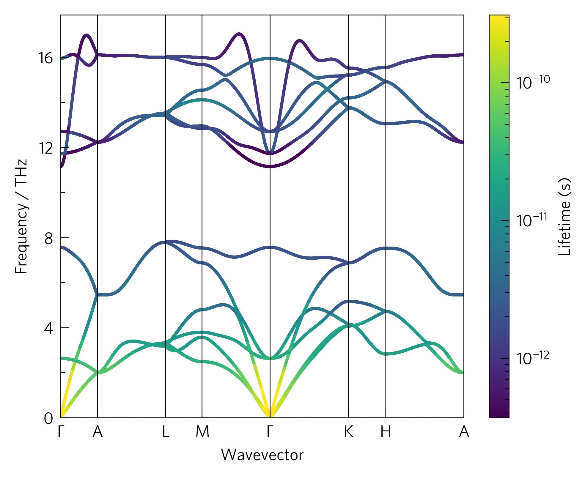
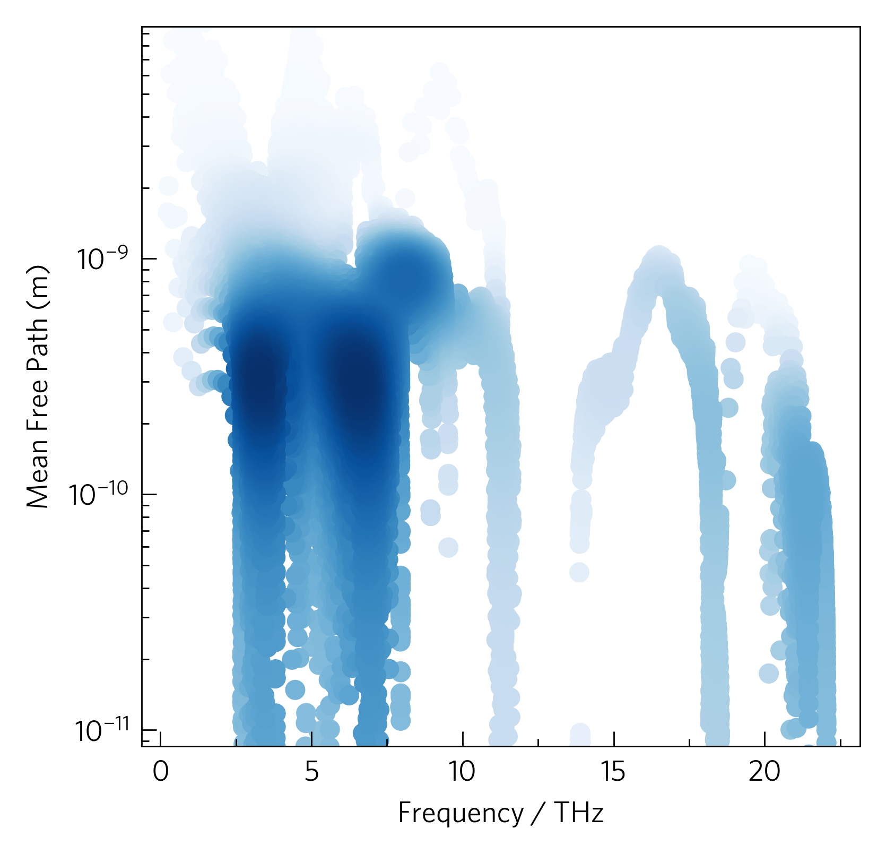

Here are some examples to help you get started with ThermoParser. The
numbered examples aim to provide a tutorial of how the package in
general works, while the rest show some more concrete examples you
might find in published work.

Some examples require large data files to run, which haven't been
included in the data folder, but can be downloaded using the
``get-data.sh`` script provided in the relevant directories. If
``wget`` doesn't work for you, navigate to the URL (``repo`` in
``get-data.sh``) in your browser to download the required file and add
it to the ``../data`` directory (``f`` in ``get-data.sh``).

cumkappa
--------

.. image:: cumkappa/cumkappa.png
   :alt: Cumulative lattice thermal conductivity against frequency and mean free path.
   :target: https://github.com/SMTG-UCL/ThermoParser/tree/master/examples/cumkappa

kappa-target
------------

.. image:: kappa-target/kappa-target.png
   :alt: Lattice thermal conductivity required to reach a given ZT against carrier concentration and temperature.
   :target: https://github.com/SMTG-UCL/ThermoParser/tree/master/examples/kappa-target

phonons
-------

.. image:: phonons/phonons.png
   :alt: Phonon dispersion and density of states.
   :target: https://github.com/SMTG-UCL/ThermoParser/tree/master/examples/phonons

multiphon
---------

.. image:: phonons/multiphon.png
   :alt: Phonon dispersions for different supercell sizes.
   :target: https://github.com/SMTG-UCL/ThermoParser/tree/master/examples/phonons

wideband
--------

.. image:: projected-phonons/wideband.png
   :alt: Phonon dispersion with broadened bands.
   :target: https://github.com/SMTG-UCL/ThermoParser/tree/master/examples/projected-phonons

projected-phonons
-----------------

waterfall
---------

.. image:: waterfall/waterfall.png
   :alt: Waterfall plot of mean free path against frequency with lattice thermal conductivity projected.
   :target: https://github.com/SMTG-UCL/ThermoParser/tree/master/examples/waterfall

density
-------

ztmap
-----

.. image:: ztmap/ztmap.png
   :alt: ZT against carrier concentration and temperature.
   :target: https://github.com/SMTG-UCL/ThermoParser/tree/master/examples/ztmap
