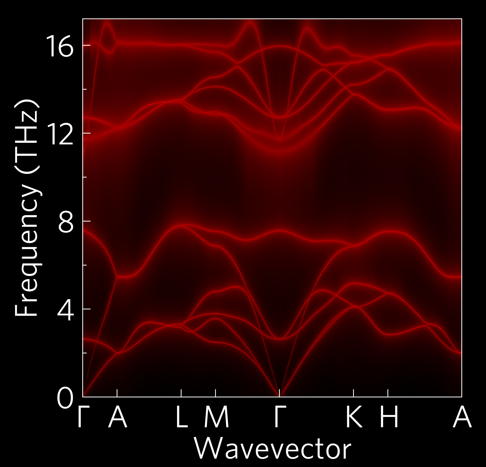
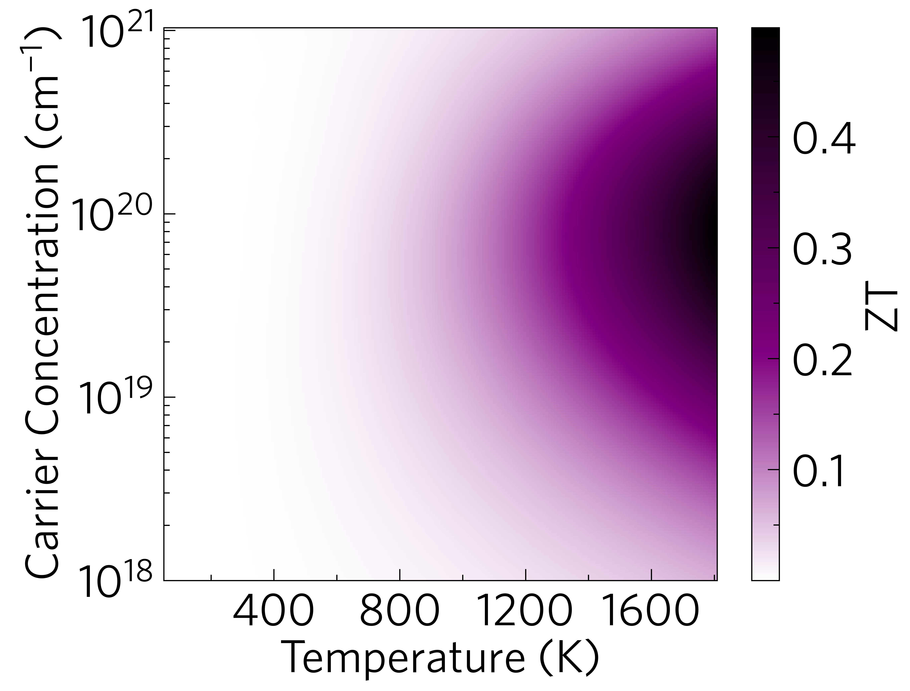

Here are some examples to give an idea of what ThermoPlotter can do.
Some require large data files to run, which haven't been included in the
data folder, but can be downloaded using the ``get-data.sh`` script
provided in the relevant directories.

cumkappa
--------

.. image:: cumkappa/cumkappa.png
   :alt: Cumulative lattice thermal conductivity against frequency and mean free path.
   :target: https://github.com/SMTG-UCL/ThermoPlotter/tree/master/examples/cumkappa

kappa-target
------------

.. image:: kappa-target.png
   :alt: Lattice thermal conductivity required to reach a given ZT against carrier concentration and temperature.
   :target: https://github.com/SMTG-UCL/ThermoPlotter/tree/master/examples/kappa-target

multiphon
---------

phonons
-------

.. image:: phonons.png
   :alt: Phonon dispersion and density of states.
   :target: https://github.com/SMTG-UCL/ThermoPlotter/tree/master/examples/phonons

projected-phonons
-----------------

waterfall
---------

.. image:: waterfall.png
   :alt: Waterfall plot of mean free path against frequency with lattice thermal conductivity projected.
   :target: https://github.com/SMTG-UCL/ThermoPlotter/tree/master/examples/waterfall

wideband
--------

ztmap
-----

