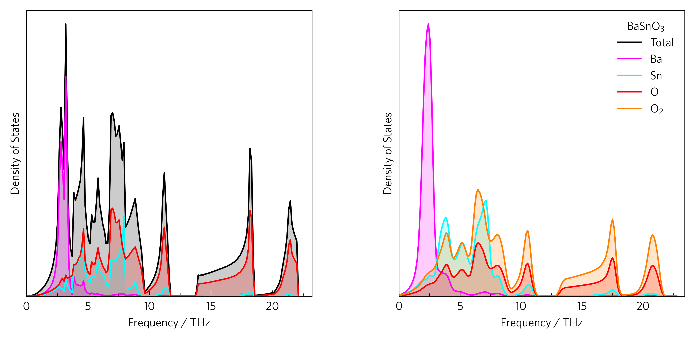

-----------------------
Density of States (DoS)
-----------------------

This shows a two densities of states (DoSs), which show the density of phonon
modes at particular frequencies.

The left plot can be generated by:

.. code-block::

    tp plot dos ../data/basno3/projected_dos.dat --total --nolegend -c pink -c cyan -c red -p ../data/basno3/POSCAR

And the right plot by:

.. code-block::

    tp plot dos ../data/basno3/projected_dos.dat --atoms "Ba Sn O O_2 2" --sigma 0.2 --location 1 -c magenta -c cyan -c red -c orange

Or the whole thing in python with:

.. literalinclude:: plot-dos.py
   :language: python
   :linenos:
   :emphasize-lines: 8-11,17,20,21

The most foolproof way of specifying colours is through a dictionary
(lines 8-11), but colours, linestyles etc. as well as atoms can also be
specified in POSCAR order.

Manually specifying ``atoms`` (line 20) rather than reading from
the POSCAR enables the separation of different environments of the same atom,
and in this instance no POSCAR is required. The default for the ``poscar``
argument is POSCAR, so often this will not need to be specified anyway.

If desired, the atom-projected dos can be disabled entirely by setting
``projected`` to ``False``, and in the same way the ``total`` can be enabled
or disabled (line 17).

To recreated experimental data more closely, Gaussian smearing can be applied
with ``sigma`` (line 21). This option may be quicker and easier than rerunning
phonopy to compare, but beware it does not detect if smearing is already
applied. A good starting value is 0.2, as used here.
