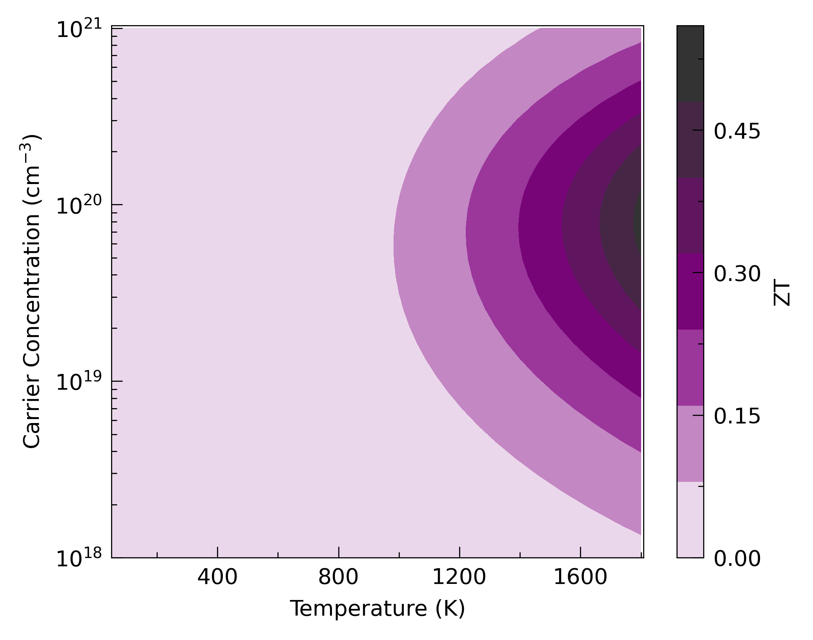
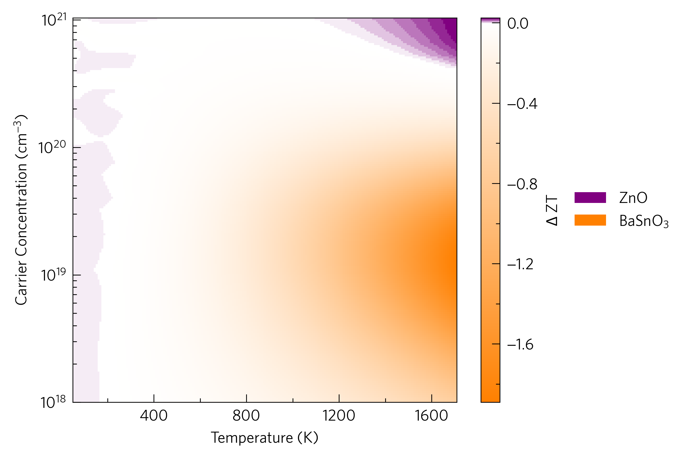

--------
Heatmaps
--------

This shows the classic ZT against carrier concentration and temperature
heatmap. This can be plotted at the command line with:

.. literalinclude:: ../../examples/heatmaps/plot-zt.sh
   :language: bash

and in python with:

.. literalinclude:: ../../examples/heatmaps/plot-zt.py
   :language: python
   :linenos:
   :emphasize-lines: 22

This uses the ``tp.plot.heatmap.add_ztmap`` function (line 22), which
calculates the ZT and sets the axes labels. All the other functionality
is wrapped within the ``tp.plot.heatmap.add_heatmap`` function, which
enhances ``pcolourmesh`` in ways such as automatic rescaling of axes to
represent all data, automatic extension of colourbars if applicable and
custom colourmaps, which are generated dynamically with the input of a
single colour, in hex, rgb (array) or named colour format. In this
case, the ``tp.plot.colour.uniform`` colourmap generator has been used,
which calculates a uniform colourmap between white, a supplied
highlight colour and black, or three colours of your choosing. There
are several other heatmap functions in ThermoParser, including the
equivalent for power factor, ``add_pfmap``, and those below...

.. image:: ../../examples/heatmaps/kappa-target.png
   :alt: Lattice thermal conductivity required to reach a given ZT against carrier concentration and temperature.

It is possible to plot a ztmap without lattice thermal conductivity
data, in which case it will be set to 1 W m-1 K-1,
which will be recorded in ``data['meta']['kappa_source']`` (other
numbers can be specified). The above is an alternative, which plots the
lattice thermal conductivity required to reach a specified ZT. We hope
this is a valuable tool to help decide wether to run expensive lattice
thermal conductivity calculations on a material. The CLI is:

.. literalinclude:: ../../examples/heatmaps/plot-kappa-target.sh
   :language: bash

and python:

.. literalinclude:: ../../examples/heatmaps/plot-kappa-target.py
   :language: python
   :linenos:
   :emphasize-lines: 18,19

The final heatmap is the ztdiff, which compares the ZTs of two
materials at a range of carrier concentrations and temperatures. This
can be done with any two materials, from completely different to the
same material under different conditions (e.g. different degrees of
nanostructuring), although this method is most appropriate for closely
related materials with similar dopabilities. Here we compare the
momentum relaxation time approximation via AMSET with the constant
relaxation approximation via BoltzTraP. At the command line:

.. literalinclude:: ../../examples/heatmaps/plot-ztdiff.sh
   :language: bash

and in python:

.. literalinclude:: ../../examples/heatmaps/plot-ztdiff.py
   :language: python
   :linenos:
   :emphasize-lines: 19,20,23

Note how list comprehensions and expansions (lines 19-20 and 23
respectively) can make the script tidier. On top of the colourbar (here
thrown away with ``_``), this function returns the handles and labels
which must be put into the legend manually if you want it. If you are
using an axes template with multiple sets of axes, the ``custom``
argument must be used in ``add_legend`` to enable manual manipulation
of the handles and labels. ``add_ztdiff`` and its power factor
equivalent, ``add_pfdiff``, also make sure the colour scale is centred
on zero (i.e. where both are equal).

Some users may find adding contours with the ``contours`` argument or making
the colour scale discrete with the ``discrete`` argument more legible or
informative.