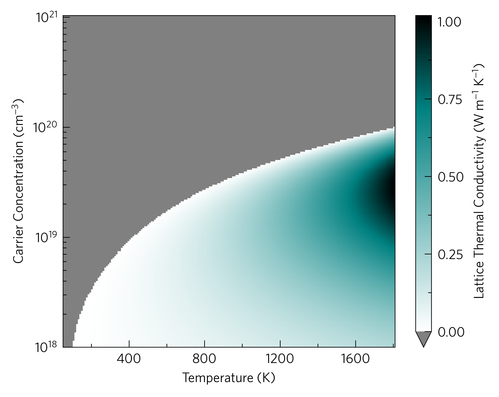

This shows the lattice thermal conductivity required to reach a given ZT
against carrier concentration and temperature. We hope this plot type
will be useful for deciding if a material is suitable to run expensive
calculations to find out what the lattice thermal conductivity is.

This is also available as a command-line script, ``tp plot kappa-target``.

This also demonstrates the ``tp.plot.heatmap.add_heatmap`` function
which ``add_ztmap`` wraps around, which enhances pcolourmesh in ways
such as automatic rescaling of axes to represent all data, automatic
extension of colourbars if applicable and custom colourmaps, which are
generated dynamically with the input of a single ``#RRGGBB`` colour
code. In this case, the ``tp.plot.colour.uniform`` colourmap generator
has been used, which calculates a uniform colourmap between white, a
supplied highlight colour and black, or three colours of your choosing,
which has the same effect as specifying that colour directly to
``add_heatmap``.
