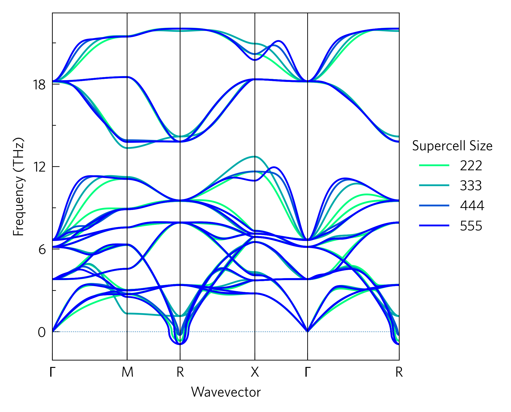

This shows phonons dispersions for various supercell sizes for
convergence. While this could be done by looping over ``tp.plot.phonons.add_dispersion``,
it is bundled into a one-liner for convenience. As phonon dispersions do
not always have the same x-scale (at least in phonopy), this rescales
the dispersions so they always match, which is also useful to compare
different materials (so long as they are at least in the same space
group and preferably closely related) or materials under expansion or
compression.

This is also available as a command line script ``tp-converge-phonons``.

This also demonstrates the large axes style, more appropriate for
presentations or posters than the default style, which is better for
papers; and also the add_legend function, which adds a pre-positioned
legend, and accepts all the other usual arguments including ``title``.
