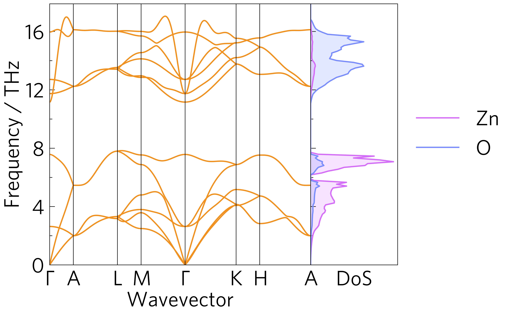

This shows a phonon dispersion and density of states (DoS). All plot-
types in ``tp.plot.frequency`` have an invert argument to plot them
side-on by a phonon dispersion, which also shortens their x-axis labels
and removes their y-axis labels and tick labels. Currently the axes of
the two plots have to be aligned manually, but this is simple
(``plot-phonons.py`` line 24).

.. image:: multiphon.png
   :alt: Phonon dispersions for different supercell sizes.

This shows phonons dispersions for various supercell sizes for
convergence. While this could be done by looping over
``tp.plot.phonons.add_dispersion``, it is bundled into a one-liner for
convenience. As phonon dispersions do not always have the same x-scale
(at least in phonopy), this rescales the dispersions so they always
match, which is also useful to compare different materials (so long as
they are at least in the same space group and are preferably closely
related), or materials under expansion or compression.

These are both also available as a command line script ``tp plot phonons``.

They also demonstrates the large axes style, more appropriate for
presentations or posters than the default style, which is better for
papers; and the add_legend function, which adds a pre-positioned
legend, and accepts all the other usual arguments including ``title``.
