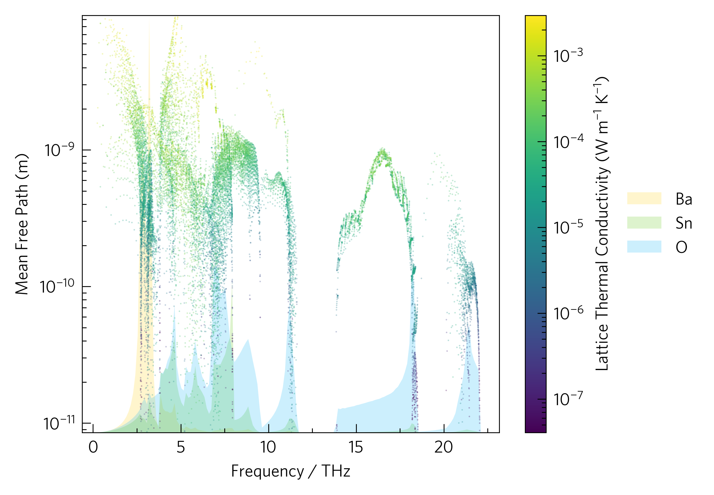

This shows a plot of mean free path against frequency with lattice
thermal conductivity projected on the colour axis, as well as a density
of states (DoS).This example highlights some complications: in order
for the waterfall to be on top of the DoS, so as not to obscure the
colour, an additional command, ``format_waterfall``, must be used so the
DoS can be scaled correctly (line 43). In addition, the long labels do
not always work well on the larger plot style, but lists of labels are
provided in the settings file which make updating them straightforward
(lines 59-60).
