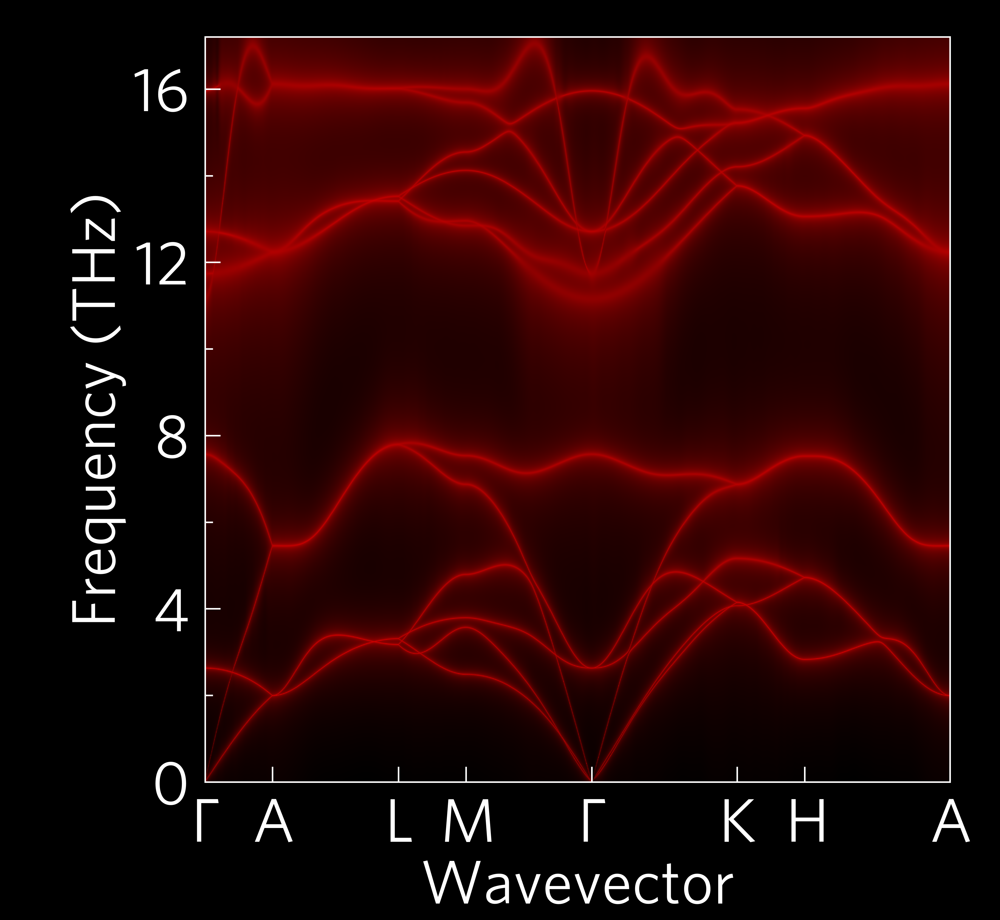

This shows a phonon dispersion with bands broadened to indicate
scattering (the widest bands scatter the most).

This is also supplied via a command-line script, ``tp-wideband``.

This also demonstrates the custom colourmaps which can be generated by
supplying a single ``#RRGGBB`` colour code as the colour input, or in
this case two (the default background is normally white, but to match
``dark_background`` style sheet, black has been used here). In this
case, ``tp.plot.colour.linear`` has been used. It also shows the large
style, more suitable to presentations or posters than the default one
which is more suited to papers.
