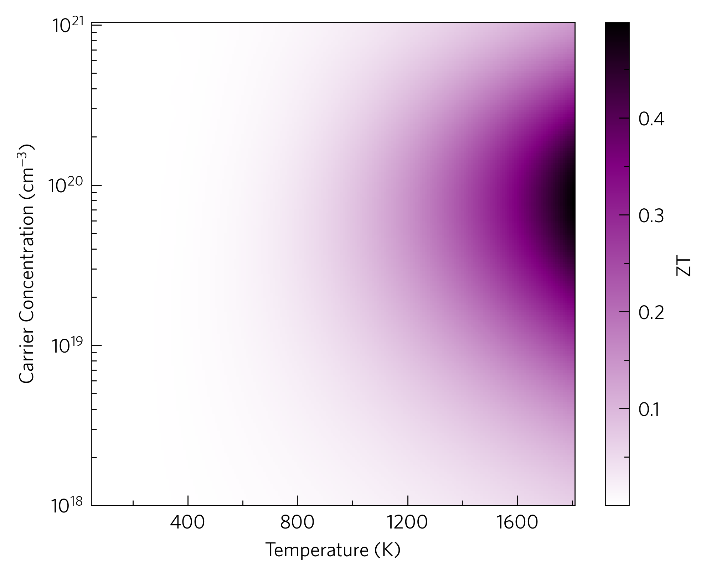

This shows the ZT against carrier concentration and temperature.

This is also available as a command-line script, ``tp-ztmap``.

This also demonstrates the ``tp.plot.heatmap.add_heatmap`` function
which ``add_ztmap`` wraps around, which enhances pcolourmesh in ways
such as automatic rescaling of axes to represent all data, automatic
extension of colourbars if applicable and custom colourmaps, which are
generated dynamically with the input of a single ``#RRGGBB`` colour
code. In this case, the ``tp.plot.colour.uniform`` colourmap generator
has been used, which calculates a uniform colourmap between white, a
supplied highlight colour and black, or three colours of your choosing.
