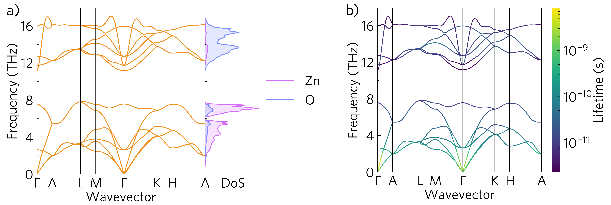
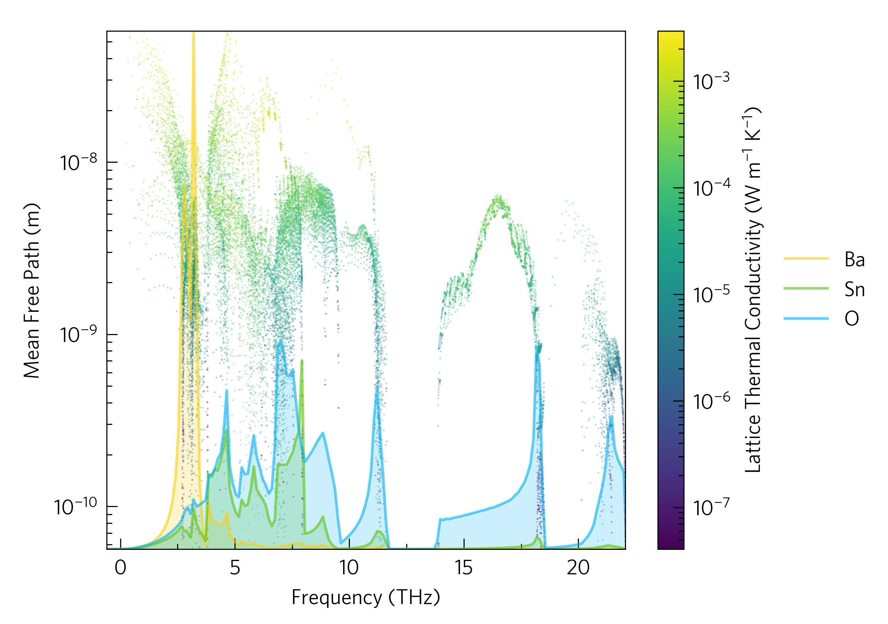

# Summary

Thermoelectric materials, which convert heat into electricity, have become an accessible area of computational materials research in recent years owing to the development of several codes capable of calculating their key properties.
These packages include Phonopy [@Togo2015a], Phono3py [@Togo2015], ShengBTE/ almaBTE [@Li2014], ALAMODE [@Tadano2014] and TDEP [@Hellman2011].
Thermoelectric performance is determined by the thermal and charge transport properties of a material, several of which are strongly interrelated.
Such complexity makes thermoelectrics an extremely interesting area of study, but a lack of readily accessible post-processing tools mean that data analysis and visualisation is often challenging and time consuming.
ThermoPlotter facilitates the post-processing of thermoelectric properties directly from the raw output of multiple software packages, resulting in publication-standard plots   [@Spooner2020;@Einhorn2020].

# Statement of Need

There already exist some tools for plotting thermoelectric properties.
For example, Phonopy has built-in modules to plot phonon dispersions and densities of states (DoSs). 
Phono3py contains a small number of auxiliary tools for plotting properties including lattice thermal conductivity and phonon mean free path.
Some command-line codes such as sumo [@Ganose2018] and Phono3py-Power-Tools [@Skelton2020], allow plotting of phonon dispersions, phonon DoSs and properties such as the modal contribution to lattice thermal conductivity.
ThermoPlotter brings two key novelties to the existing software landscape:
First, the automatic parsing of outputs from multiple codes into a common format;
Second, the ability to plot this data as publication-ready figures using an intuitive Python API, accessible to Python novices while fully customisable.
There is also a suite of command-line scripts for quick and easy plotting.

# ThermoPlotter

ThermoPlotter is a Python package for analysing and plotting thermoelectric properties.
The main dependencies are matplotlib [@Hunter2007] for plotting, pymatgen [@Ong2013] for symmetry analysis and numpy for calculations.
The package interfaces with Phonopy, Phono3py, AMSET [@Ganose2020] and BoltzTraP [@Madsen2006]. 
It is written to allow for easy expansion to other codes, which is planned for future releases.

The interface is designed to be accessible to those unfamiliar with Python, with the simplest plots requiring just four lines of code.
More complex plots can be achieved by making full use of the Python API.
In general, raw data is converted to high-quality plots in four stages:

 1. Axes: Choose pre-sized axes suitable for publication or presentation from `tp.axes`.

 2. Load: Use the `data.load` module to parse outputs of other codes, standardising variable names, formatting and ensuring consistency across code versions. There is also a module which efficiently runs BoltzTraP and saves the output.

 3. Add: Use the `plot` module to add plots to the axes. Options exist for scaling data, multiple plots per set of axes, and other customisation options. 

 4. Save: Use `matplotlib.pyplot.savefig` or similar.

The `tprc.yaml` file allows users to set a range of defaults, including axis labels, tick locators, style sheets and more. 
While a [gallery](https://smtg-ucl.github.io/ThermoPlotter/gallery.html) is curated to demonstrate all plotting functionality, we highlight some key examples in Figures 1 and 2. 

\autoref{fig:phonon}a shows a phonon dispersion with an element-decomposed DoS sharing the y axis.
Different environments for the same atom type can be specified, if desired, and it is possible to overlay multiple dispersions to assess calculation convergence.
\autoref{fig:phonon}b shows the same dispersion with lifetime projected on the colour axis. Data from both Phono3py and Phonopy is parsed, and ThermoPlotter internally calculates mean free path and phonon lifetime.
Several other ways of projecting a range of properties onto a phonon dispersion are implemented, including the broadened bands plot (`tp.plot.frequency.add_wideband`), which is more commonly seen in the literature.

\autoref{fig:waterfall} is a waterfall plot of mean free path against frequency overlaying a DoS plot, clearly showing the relationship between elemental composition and scattering.
Scaling the linear-scaled DoS data to the log-scaled waterfall axes would be time-consuming on a case-by-case basis, whereas the `tp.plot.frequency.add_dos` function wil autodetect the data range and rescale appropriately if the `scale` argument is set to `True`. 

# Author Contributions

The primary code base was largely written by KBS based on standalone scripts written by KBS and ME.
ME implemented functions to plot the density of phonon modes.
DWD provided day-to-day supervision and guidance and DOS provided the initial idea and motivation for the code.
The first draft of the manuscript was written by KBS and DWD with input from all co-authors. 

# Conflicts of Interest

There are no conflicts to declare.

# Acknowledgements

KBS, DWD and DOS acknowledge support from the European Research Council (grant 758345).
This work made use of the ARCHER UK National Supercomputing Service via the Materials Chemistry Consortium, which is funded by EPSRC (EP/L000202), and resources made available via the UK Materials and Molecular Modelling Hub, which is partially funded by EPSRC (EP/P020194/1).
We would like to acknowledge contributions of ideas and time from Bonan Zhu, Seán R. Kavanagh and Warda Rahim.

# References