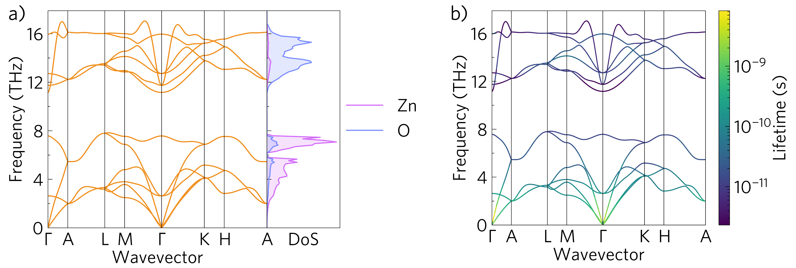
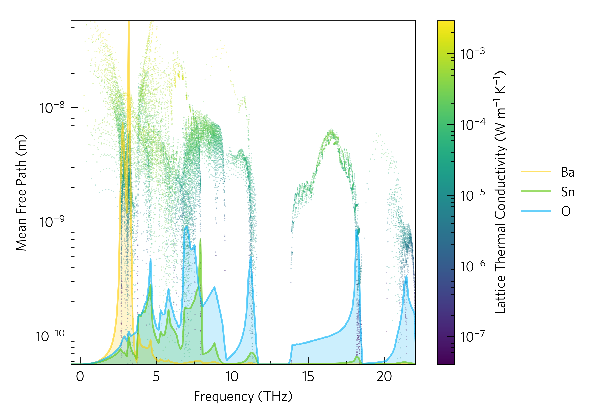

# Summary

Thermoelectric materials, which convert heat into electricity, could be an important renewable energy source to help slow the encroaching climate crisis.
With the growing computational capacity and development of several codes to calculate the key properties of thermoelectrics, they have become an increasingly popular area of computational materials research in recent years.
Thermal transport packages include Phonopy [@Togo2015a], Phono3py [@Togo2015], ShengBTE/ almaBTE [@Li2014], ALAMODE [@Tadano2014], TDEP [@Hellman2011] and HiPhive [@Eriksson2019]; and electronic transport packages include BoltzTraP(2) [@Madsen2006;@Madsen2018], EPW [@Noffsinger2010], EPA [@Samsonidze2018], EPIC STAR [@Deng2020], AMSET [@Ganose2021], Perturbo [@Zhou2021], TOSSPB [@Poehls2022] and ElecTra [@Graziosi2023].
While separate packages are required for such different calculations, this makes data analysis complex, needing to load in different file formats, account for different data arrangements (e.g. array shapes), and convert to consistent units, even before one begins analysing anything.
ThermoParser deals with these time-consuming and error-prone problems by loading data from multiple codes into a consistent data format with informative metadata, and facilitates the post-processing of thermoelectric properties by using this to accurately calculate and visualise them through an easy-to-use command-line interface (CLI) and a fully customisable Python package.
Some of its utility can be seen by its use in the literature [@Spooner2020;@Einhorn2020;@Kavanagh2021;@Spooner2021;@Brlec2022;@HerringRodriguez2023].

# Statement of Need

To the best of our knowledge no package exists for processing data from the vastly different sets of calculations needed to study thermoelectrics computationally.
While there are several codes to aid with individual aspects of thermoelectric calculations, such as the inbuilt analysis sections of Phonopy and AMSET or packages such as Phono3py-Power-Tools [@Skelton2020] and sumo [@Ganose2018], they are specialised to either the phononic or electronic side.
ThermoParser brings three key novelties to the existing software landscape:

* The automatic parsing of outputs from multiple codes for both electronic and phononic calculations;
* A data system which is transparent in the origin, arrangement and units of the data, customisable, and accessible regardless of Python aptitude;
* Plotting tools for the creation of publication-ready figures through an intuitive Python API, accessible to Python novices while fully customisable for making complex, information-rich graphics, with the most common plots also availble via a CLI.

To complement these capabilities, there is also a range of ancillary functions which streamline all parts of the process.

# ThermoParser

ThermoParser is a Python package for analysing and plotting thermoelectric properties.
The main dependencies are matplotlib [@Hunter2007] for plotting, pymatgen [@Ong2013] for symmetry analysis, numpy for calculations and click for the CLI.
The package interfaces with Phonopy, Phono3py, AMSET and BoltzTraP.

The package is modular, with a separate function for loading from each code, plotting each graph-type and preparing each axis arrangement, as well as numerous helper functions for calculating properties, manipulating data, and fomatting outputs.
Therefore, in order to add support for a new code, calculated property or plot-type, one needs only create a single function able to read/write the common format, and perhaps some metadata, and the rest should just work.
Everything loaded into the common format has a `meta` directory, containing all the metadata needed to understand the data: the code it was loaded from, the shape of the array (e.g. if the first index is temperature) and the units, as well as any conditions imposed, such as if the data has been reduced to a particular temperature.
All dependent variables are also loaded by default.
A `tprc.yaml` config file is supplied, which enables the user to automatically convert units, and update the units as they appear in the metadata and on axis labels.
This data is used by CLI functions provided to retrieve data from files, which verbosely describes the conditions under which it was measured for maximum transparency.

Plotting simple plots can be done easily via the CLI, but the Python interface is designed to be accessible to those unfamiliar with Python, with the simplest plots requiring just four lines of code.
More complex plots can be achieved by making full use of the Python API, but oftentimes still only require adding an extra `plot` line.
In general, raw data is converted to high-quality plots in four stages:

 1. Axes: Choose pre-sized axes suitable for publication or presentation from `tp.axes`.

 2. Load: Use the `data.load` module to parse outputs of other codes, standardising variable names, formatting and ensuring consistency across code versions. There is also a module which efficiently runs BoltzTraP and saves the output.

 3. Add: Use the `plot` module to add plots to the axes. Options exist for scaling data, multiple plots per set of axes, and other customisation.

 4. Save: Use `fig.savefig` or similar.

The `tprc.yaml` file allows users to set a range of defaults, including axis labels, tick locators, style sheets and more.
While a [gallery](https://smtg-ucl.github.io/ThermoPlotter/gallery.html) is curated to demonstrate all plotting functionality, we highlight some key examples in Figures 1 and 2.

\autoref{fig:phonon}a shows a phonon dispersion with an element-decomposed DoS sharing the y-axis.
Different environments for the same atom type can be specified, if desired, and it is possible to overlay multiple dispersions to assess calculation convergence.
\autoref{fig:phonon}b shows the same dispersion with lifetime projected on the colour axis.
Data from both Phono3py and Phonopy is parsed, and ThermoParser internally calculates mean free path and phonon lifetime.
Several other ways of projecting a range of properties onto a phonon dispersion are implemented, including the broadened bands plot (`tp.plot.frequency.add_wideband`), which is more commonly seen in the literature [@Togo2015].
This also demonstrates the utility of ThermoParser's consistent data format: as well as Phono3py data, Gruneisen parameter data from Phonopy can be projected onto phonon dispersions in the same way, by changing only which data is loaded and setting `quantity='gruneisen'` rather than `'lifetime'`.

\autoref{fig:waterfall} is a waterfall plot of mean free path against frequency overlaying a DoS plot, clearly showing the relationship between elemental composition and scattering.
Scaling the linear-scaled DoS data to the log-scaled waterfall axes would be time-consuming on a case-by-case basis, whereas the `tp.plot.frequency.add_dos` function wil autodetect the data range and rescale appropriately if the `scale` argument is set to `True`.

Future directions for ThermoParser include increasing the number of supported codes; and functions to extract and add metadata to experimental data to enable easier comparison of theoretical and experimental results.

# Author Contributions

The primary code base was largely written by KBS based on standalone scripts written by KBS and ME.
ME implemented functions to plot the density of phonon modes.
DWD provided day-to-day supervision and guidance and DOS provided the initial idea and motivation for the code.
The first draft of the manuscript was written by KBS and DWD with input from all co-authors.
The code is currently maintained by KBS.

# Conflicts of Interest

There are no conflicts to declare.

# Acknowledgements

KBS, DWD and DOS acknowledge support from the European Research Council (grant 758345).
This work made use of the ARCHER2 UK National Supercomputing Service via the Materials Chemistry Consortium, which is funded by EPSRC (EP/L000202), and resources made available via the UK Materials and Molecular Modelling Hub, which is partially funded by EPSRC (EP/P020194/1).
K.B.S and D.O.S acknowledge the University of Birmingham’s BlueBEAR HPC service (http://www.birmingham.ac.uk/bear); the Baskerville Tier 2 HPC service (https://www.baskerville.ac.uk/), which was funded by the EPSRC and UKRI through the World Class Labs scheme (EP/T022221/1) and the Digital Research Infrastructure programme (EP/W032244/1) and is operated by Advanced Research Computing at the University of Birmingham; and the Sulis Tier 2 HPC platform hosted by the Scientific Computing Research Technology Platform at the University of Warwick, which is funded by EPSRC Grant EP/T022108/1 and the HPC Midlands+ consortium.
We would like to acknowledge contributions of ideas and time from Katarina Brlec, Bonan Zhu, Seán R. Kavanagh, Warda Rahim, Joe Willis, Luisa Herring--Rodriguez and Sabrine Hachmioune.

# References
